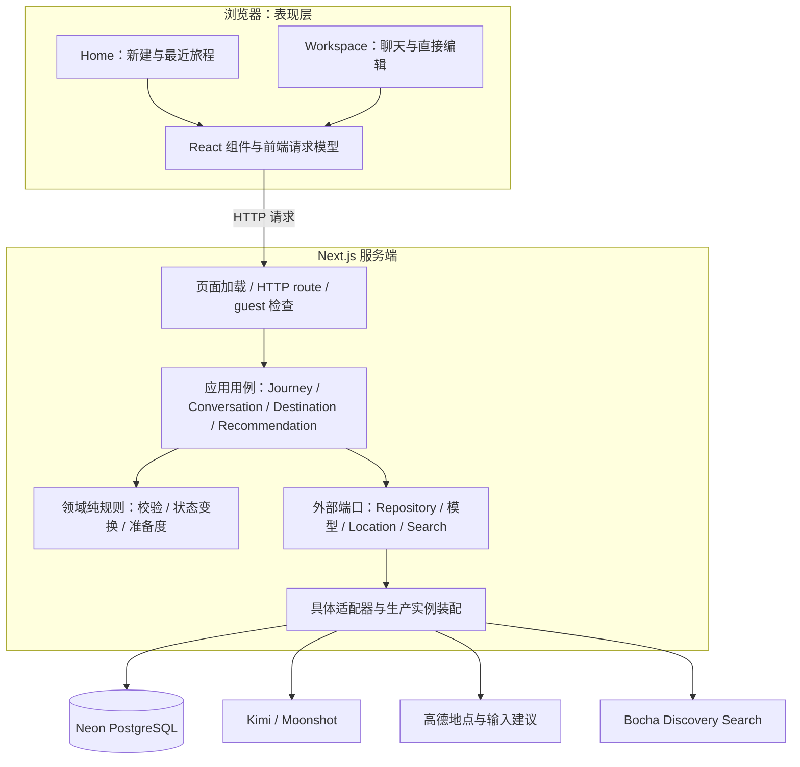
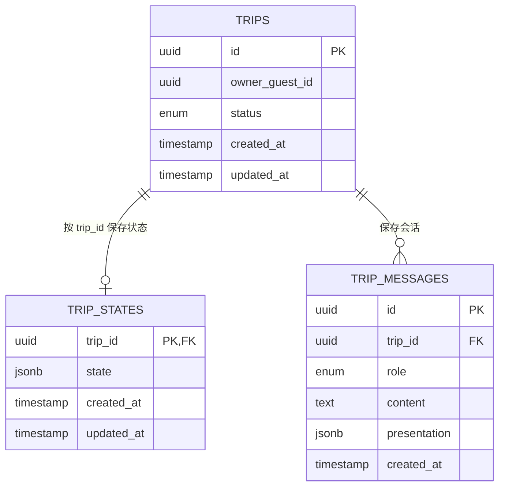
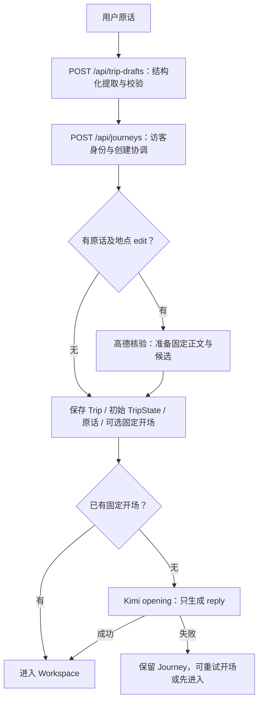
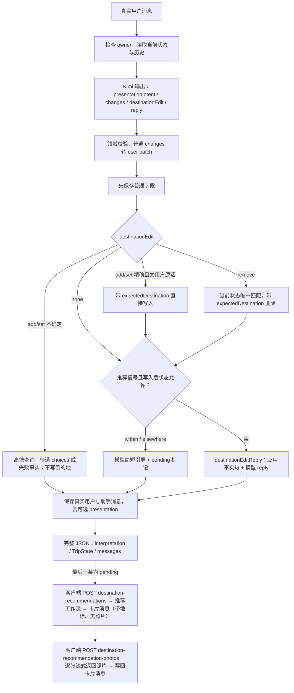
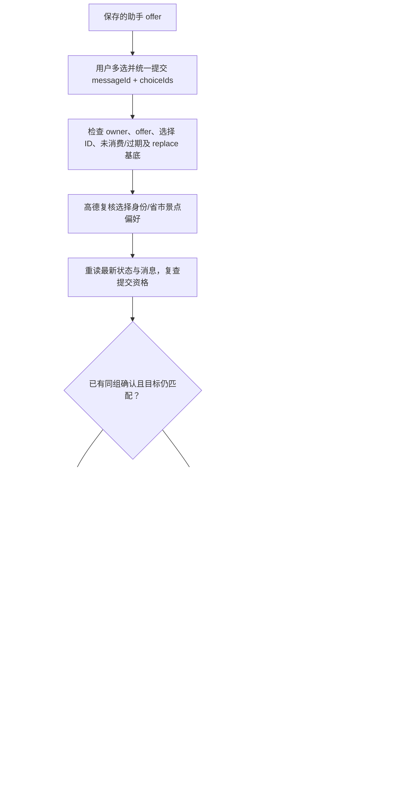
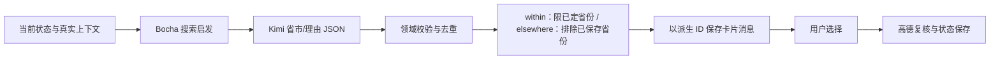

# Meri 技术架构

> 核对日期：2026-10-01。本文描述当前仓库架构，并将未来方向单独列出。Meri 是以 Journey 为中心的 Next.js 全栈应用，采用按能力分模块的分层结构。详细业务操作见 [USER_FLOW_CURRENT.md](USER_FLOW_CURRENT.md)，目录与逐文件职责见 [CODEBASE_GUIDE.md](CODEBASE_GUIDE.md)。

## 1. 架构总览

### 1.1 当前系统结构



页面服务端读取和 API 共用应用服务；客户端通过本应用 API 修改状态。部分编排目前仍在 route 中，端口定义在 `platform`，`*-instance.ts` 装配具体实现。这是实际职责划分，不宣称已严格实现全部 Clean Architecture 依赖约束，也不是微服务。

**主原则：**确定步骤和核心规则由代码执行；模型理解语言并提出数据。TripState 是用户当前决定的权威来源，聊天、建议卡和模型输出都不是另一份状态。

### 1.2 当前能力与未来能力

| 状态 | 能力 |
| --- | --- |
| 已实现 | 访客所属 Journey、自然语言创建、持久化会话、普通字段编辑、目的地省/市/spot、显式多选确认、推荐与准备度检查 |
| 已实现但有范围限制 | PWA manifest/图标，无离线缓存；推荐使用搜索启发，无访问检查或排序；地点照片只作装饰 |
| 未实现 | 真正 Generate Plan、Research Agent、实时天气/路线研究、证据系统、后台监控、Adaptive Workspace |

## 2. 技术栈与接入位置

版本以 [package.json](../package.json) 和 [package-lock.json](../package-lock.json) 为准。下表写关键版本或版本系列，不把 npm 的 `^` 声明当作固定安装版本。

| 技术/工具 | 当前用途 | 接入位置 | 边界/状态 |
| --- | --- | --- | --- |
| Next.js 16.3.5 / App Router | 页面、服务端组件、HTTP route、metadata/manifest | `src/app/`、`next.config.ts` | 开发前读安装包内相关 Next.js 指南 |
| React 19.2.8 / TypeScript 5 | UI、状态协调、类型及业务契约 | `src/components/`、`src/domain/`、`tsconfig.json` | 类型检查不能代替运行时校验 |
| CSS Modules / 全局 CSS | 页面与组件样式、响应式布局 | `*.module.css`、`src/app/globals.css` | 当前没有整套 Tailwind UI 样式框架 |
| Motion 13 / Radix Popover / Lucide / Embla | 入场与浮层动画、照片环旋转、图标、首页最近旅程轮播、聊天卡片按省横滑 | `src/components/ui/`、`src/components/meri-shell/`、`journey-orbit.tsx`、`destination-choices-card.tsx` | 已用现有交互；背景水彩显露尚未实施 |
| 界面语言（自建，无 i18n 库） | 首页中/英切换，全部界面文字的字典 | `src/components/i18n/`、`src/platform/locale/`、`src/components/ui/language-toggle.tsx`、根布局 | cookie `meri_locale` 优先，否则 Accept-Language；不使用 `/[lang]` 路由；首页、旅程页面和列表页的界面文字以及 Meri 在代码里写的句子（`capabilities/conversation/meri-replies.ts`）都已覆盖，不判断用户输入的语言；模型回复语言待后续步骤 |
| react-day-picker 10 | “何时”范围日历（中文 locale，样式通过 CSS 变量换成 Meri 配色） | `src/components/trip-workspace/trip-dates-editor.tsx` | 已用于日期选择 |
| Vercel AI SDK 6 / `@ai-sdk/react` 3 | 服务端结构化模型调用、前端 useChat/transport 适配 | `src/platform/llm/ai-sdk-kimi-client.ts`、`workspace-chat-transport.ts` | 当前 API 返回完整 JSON，前端逐字显示不是服务端 token 流 |
| Kimi / Moonshot（默认 kimi-k2.6） | 草稿、Workspace 解释、opening 和推荐生成 | `src/platform/llm/`、各能力的 `prompts/` | `LLM_MODEL` 可覆盖；默认超时 60 秒、零 SDK 自动重试 |
| OpenAI SDK 7 | 保留的旧 Kimi 兼容客户端 | `src/platform/llm/kimi-client.ts` | 当前主应用默认走 AI SDK；此文件同时定义共享客户端契约 |
| Zod 4 / 自定义领域校验 | 推荐结构校验及其他输入/模型/状态契约验证 | `src/domain/` | 不把外部 JSON 直接当可信业务数据 |
| Neon PostgreSQL / Neon serverless | 跨请求持久化身份、状态与消息 | `src/platform/persistence/database/db.ts` | HTTP 数据库客户端；数据不依赖 Web 实例内存 |
| Drizzle ORM 0.45 / Drizzle Kit | schema、查询、JSONB 条件更新与迁移 | `src/platform/persistence/`、`drizzle/`、`drizzle.config.ts` | 迁移文件存在不代表在线环境已执行 |
| 高德 Web API | 地点关键词核验与 InputTips 建议 | `src/platform/location-provider/`、`src/platform/amap/amap-fetch.ts`（所有高德调用共用一个队列：开始间隔 ≥350ms，超时从发出时起算；被限流时整队暂停 1 秒，被拒请求排队首重试，最多 3 次） | 身份核验不证明开放、安全、交通或可达 |
| 高德地点照片（v5 搜索 `show_fields=photos`） | 卡片、照片环、标题图的装饰照片 | `src/platform/place-photos/`、`next.config.ts` 的 images.remotePatterns | http 地址升级为 https；只允许两个照片主机；只缓存真实答案的进程内缓存 7 天（不用 fetch 缓存，因限流也返回 HTTP 200）；失败即无图 |
| Bocha Web Search | 推荐的启发性搜索上下文 | `src/platform/search/` | 最多 8 条；失败降级，不当作已核验证据 |
| Pino 10 | 结构化事件与错误日志 | `src/platform/observability/` | requestId 关联请求；错误序列化脱敏 |
| Node test runner / tsx / ESLint 9 / tsc | 相邻单元/边界测试、lint、类型检查 | `*.test.ts(x)`、`package.json`、`eslint.config.mjs` | mock 回归不代表真实外部接口验收 |

## 3. 分层职责与依赖

各层采用固定栏目：**职责 → 代码位置 → 依赖/输出 → 限制**。

| 层 | 职责 | 代码位置 | 依赖/输出 | 当前限制 |
| --- | --- | --- | --- | --- |
| 页面/接口入口 | URL、cookie、请求校验、HTTP 错误及服务端初始读取 | `src/app/`、`src/app/api/` | 应用服务；输出页面或 JSON | 聊天等 route 仍承担部分流程编排 |
| 表现层 | 渲染、编辑、暂选、pending/error、同步保存结果 | `src/components/` | 领域类型、展示纯函数、本应用 API | UI 提示不能替代服务端资格检查 |
| 领域层 | Trip/State/Message 等契约，合法状态和纯规则 | `src/domain/` | 不调用网络或数据库；输出规范对象/状态变换 | 不解释未知提供方身份，不生成 UI 代码 |
| 应用层 | 为一次用户操作编排校验、查询、保存及回复 | `src/capabilities/` | 领域规则和外部端口 | 不是通用 Agent runtime |
| 基础设施层 | 模型、地图、搜索、身份、日志、数据库适配 | `src/platform/` | provider SDK/HTTP、Neon/Drizzle；返回规范化结果 | 端口和实现目前同属 platform，并非完全强制隔离 |

### 3.1 应用能力模块

| 模块 | 输入 | 核心职责 | 输出与持久化 |
| --- | --- | --- | --- |
| `journey` | TripDraft、owner、patch | 创建/加载/更新/删除、失败补偿、列表投影 | Trip + TripState；创建时可保存原话和固定开场 |
| `conversation` | 当前状态、原话、真实历史 | 结构化解释、opening、上下文裁剪、消息服务 | 修改提案/正文及持久化 TripMessage |
| `destination` | 地点表达、当前目的地或保存的 choice | 查询协调、行政归属/spot 映射、候选/唯一删除、提交复核 | 用户原话的精确匹配直接写入，其余为待选 choices；模型改写的名称不自动保存 |
| `recommendation` | 当前状态、真实历史、调用来源 | 判断推荐范围（within/elsewhere），pending 还原后搜索→生成→校验→省份过滤；卡片出现后另行查照片并流式返回 | 卡片作为独立助手消息保存，照片随后写回该消息，不直接改目的地 |

## 4. 数据模型与持久化

### 4.1 权威模型

| 模型 | 内容 | 存储/来源 | 权威边界 |
| --- | --- | --- | --- |
| Trip | ID、ownerGuestId、status、时间戳 | `trips` | Journey 身份与生命周期根 |
| TripState | name、origin、destination、startDate、endDate、duration、transportPreference | `trip_states.state` JSONB | 当前用户决定的权威状态 |
| TripMessage | user/assistant、正文、可选 presentation、时间戳 | `trip_messages` | 真实历史，待选卡不是用户决定 |
| JourneySummary | 列表用标题、目的地、日期等摘要 | Trip + TripState 查询投影 | 读模型，不可作为更新基底 |
| TripDraft / Interpretation | 草稿或四项聊天 JSON | 本次调用中校验 | 模型提案，不是持久化状态 |

当前数据库关系（完整字段目录、约束和读写路径见 [DATABASE_SCHEMA.md](DATABASE_SCHEMA.md)）：



TripState 对完整 Journey 必须存在，但表关系不强制每个 Trip 都有状态，因此缺失状态需要专门处理。删除 Trip 通过外键级联删除状态和消息。当前 schema 不包含 `trip_user_actions`；历史迁移 0007 创建该表，0009 定义删除。推荐只从聊天触发，来源只在 context 标为 `conversation`。

### 4.2 字段与目的地结构

普通字段支持 known/approximate/ambiguous/missing，保留 user/system 来源。destination 为 missing 或 known，known 保存省→市/自治州→spots，并从结构派生展示文本：

```text
destination.areas[]
  province
  places[]
    name          市/自治州
    spots[]       用户想去的景点名称
```

最终 spots 只存名称，不存精确 POI/坐标。旧自由文本保留在 `legacyText`，不编造行政身份。删除市级联 spots 并保留空省；单删 spot 保留市；删省移除全部子项。

## 5. 关键请求流程

### 5.1 Home 创建 Journey



初始 destination 为 missing；用户原话里的地点被高德精确匹配时直接写入初始状态，其余先出卡。状态/初始消息保存失败尝试删除 Trip，这是补偿回滚；清理失败保留创建与清理错误。普通 opening 不允许 changes、目的地 edit 或推荐意图；稳定助手 ID 和现有消息检查支持重试，不重新创建 Journey。

### 5.2 Workspace 聊天与分支



地点 edit 出卡或有找不到的表达时本轮不推荐；推荐范围按写入后的状态判断：within 要求目的地 missing 或只有未选城市的省范围，elsewhere（“推荐别的省份”）要求已有省份且只推荐未保存的省份。普通字段先丢弃不改变字段的 change；模型 reply 不得宣称地点已添加或旅程可生成，这些句子由 `turn-reply.ts` 生成，准备度只在首次可规划时说一次。历史最多 5 轮/6000 字符，合并连续助手消息；建议不是已选。实际分支在 messages route，未调用 `workspace-turn-branch.ts`。候选/查询失败/删除歧义等正文由应用事实决定；普通对话和成功无失败项删除可用模型 reply。

### 5.3 候选多选与确认

新聊天的 set/add 都生成追加卡；“我想去青岛”不会移除云南，只有用户明确不去某个已保存地点才走 remove，按省/市/spot 级联规则处理。以下 replace 分支仅兼容旧版本已持久化卡片，不再由新聊天生成。



客户端也把已确认卡和后面有新对话的旧卡设为只读；服务器资格检查不能省略。同省/市/spot 的重复 POI 按偏好归并，历史原 ID 保留；不同目标仍独立。新增偏好不是精确 POI 消歧。已核验省范围有专门的选择路径，并非所有 card 都重新查询坐标。

手动搜索独立使用 `GET/POST/DELETE /api/trips/[id]/destinations`：添加时重新查询并匹配 provider ID，删除完整省/市/spot 元组，旧文本通过显式 legacy 操作清除。

### 5.4 推荐与准备度



最多 12 个建议地点；Discovery 失败降级为空搜索上下文，模型失败仍报错（卡片请求返回 502，界面可重试）。推荐分两个请求：聊天请求只保存模型的简短引导和 `destination_recommendations_pending` 标记，客户端再调用 `POST /api/trips/[id]/destination-recommendations`；该接口从保存的对话还原触发原话，只为仍是最新消息的 pending 生成卡片，卡片消息 ID 由 pending 消息派生，重复请求返回同一条。推荐只从聊天触发，使用真实原话；没有推荐按钮入口，不另存 action、不伪造 user 消息。未接通访问检查或排序，workflow 是普通确定性编排，不是 Vercel Workflow runtime 或 Agent 循环。卡片不等照片：每张卡带配图用的地标先保存返回，客户端再调用 `POST /api/trips/[id]/destination-recommendation-photos`，服务器每查到一张照片就以 NDJSON 流式推一行，全部查完后写回该卡片消息的 presentation（消息唯一的更新），卡片在照片到达前显示骨架块。

Generate plan 只有一个，位于聊天下方：missing→按钮不可用并在悬停/聚焦时说明添加目的地的途径，有 legacyText→重新确认/清除，其余（包括只有省、没有市）→准备度通过但规划尚未开放。出发地、日期、时长和交通目前不是硬门槛，准备度通过不证明安全或可行。

## 6. 一致性、错误与可恢复性

| 边界 | 当前机制 | 仍需准确说明的限制 |
| --- | --- | --- |
| 所有权 | guest cookie + owner-scoped Trip 查询，缺失/他人 Journey 返回相同 not-found | 无账号协作权限系统 |
| 外部输入 | 模型 JSON、请求体、提供方数据和数据库读取经过校验；聊天解释和首页草稿逐项挽救，不合格的单项丢弃并记日志，其余照常执行 | 不能靠 TypeScript 断言信任外部数据；没有可用 reply 或不是对象时整轮仍失败 |
| 状态更新 | 最新状态应用 patch，CAS 最多 3 次；Postgres UPDATE 比较原始 JSONB | 无 CAS 的测试替身允许退回 update，不能代表生产保护 |
| 目的地并发 | 专用操作带 expectedDestination，冲突拒绝旧 patch；普通字段重读重算 | 通用 state PATCH 仍接受 destination，未统一高德核验，冲突错误当前未单独映射 409 |
| 保存与会话 | 保存真实正文及 presentation，刷新重读；选卡半成功返回真实状态；推荐卡照片查完后只替换该消息的 presentation | 状态与会话不是跨所有步骤的一笔事务，普通聊天失败需刷新核对 |
| 重试 | 开场/同组选卡确认/推荐卡片使用稳定身份；过期卡不能恢复删除项 | 普通聊天 POST 没有全局幂等保证；同一 pending 并发请求可能各跑一次工作流，但只保存一条 |
| 旧数据 | 旧目的地/卡片读取适配，无法核验文本保留 legacyText | 不静默丢弃或将景点假装成市；spot 同名不能只靠状态区分 POI |
| 提供方故障 | Kimi 错误/超时归一化；Bocha 搜索可降级；高德故障不编造地点 | 手动 destinations 归属加载当前将异常统一视为 not-found |
| 日志 | Pino 事件、requestId、耗时、错误脱敏 | 不输出密钥；调试输出按环境配置 |

准确 HTTP 状态、请求体及每个操作的失败恢复见 USER_FLOW_CURRENT。上述限制是现有实现记录，本轮文档更新不顺带修复代码或增加事务框架。

目的地限定在中国，用户可以来自任何国家：草稿、开场、聊天和推荐提示词说明服务范围，聊天只在用户提到中国以外的目的地时才说明，不使用“国内/国外”的说法；`china-destination-scope.ts` 提供省级行政区名单，推荐生成 schema 与运行时校验、地点解析、手动搜索候选和选卡复核共用该范围。名单不是城市/景点归属证明，新增目的地仍需提供方核验。旧状态读取及删除不受新范围阻断。

聊天历史和 TripState 已持久化，但没有跨 Journey 长期偏好记忆、摘要记忆或向量检索；历史窗口扩大仍属于上下文选择的调整。

## 7. 未来方向（未实现）

未来 Generate Plan 可能基于当前 TripState 研究天气、路线、交通、开放/访问和风险，再产出可保存计划。Research Agent 只有在下一步需依据观察结果决定时才有意义；模型参与固定步骤不自动构成 Agent。

后续研究需保留来源、新鲜度、不确定性和可恢复错误，明确停止条件、调用/时间预算与权限边界。不能从聊天恢复已删除偏好，不能静默覆盖用户决定。当前不选择通用 Agent、模型路由、向量库或 UI 决策框架。

Adaptive Workspace 的简短方向见 [product/adaptive-workspace.md](product/adaptive-workspace.md)，只保留设计意图，不作为当前实施任务。小熊的精灵图与行为已实现于 `src/components/companion/`，设计说明及待定项见 [product/companion-bear.md](product/companion-bear.md)。新增能力应由实际产品需求推动。

## 8. 验证与运行边界

`npm run lint`、`npm run typecheck`、`npm test`、`npm run build` 分别检查规则、类型、Node 测试和生产构建。测试按文件邻近组织，覆盖领域规则、应用分支、提供方适配、并发与错误；外部系统多为 mock，`scripts/verify-*.ts` 是需配置的人工真实调用，不和单测通过混为一谈。

运行配置见 README 和 `.env.example`：数据库/Kimi/高德在服务端读取密钥，Bocha 缺失可降级。页面有 manifest 和图标，未实现 service worker/offline cache。文档记录仓库支持标准 Next.js 部署，不证明已部署到任何指定平台。

## 9. 本文更新格式

后续新增技术/能力时，按现有栏目补充，不另造一份平行架构说明：

1. **技术栈表：**技术/工具、当前用途、接入位置、边界/状态；版本核对 package 和 lock。
2. **模块职责：**输入、职责、输出/持久化；明确入口、应用、领域及适配器各做什么。
3. **流程图：**只画实际调用，标出校验、外部调用、保存、显式确认和关键失败分支。
4. **数据与可靠性：**注明权威来源、写入方式、所有权、并发、重试和半成功恢复。
5. **未来方向：**单独标“未实现”，不放进当前运行图，也不因写进文档自动授权实施。
6. **关联文档：**同步 CODEBASE_GUIDE 的文件索引、DATABASE_SCHEMA 的表/字段关系和 USER_FLOW_CURRENT 的详细操作，保留向用户讲解的细节。
