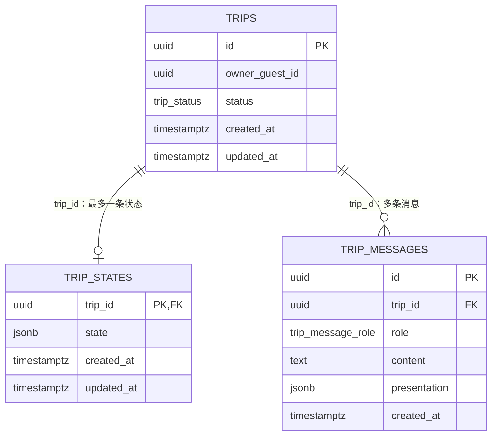

# Meri 数据库结构与关系目录

> 核对日期：2026-10-01。根据当前 Drizzle schema、repository 和迁移文件整理，供 AI 定位代码及向用户讲解。本文记录仓库定义，不代表已检查某个在线数据库的实际表或迁移执行状态；本次没有连接数据库或执行迁移。

阅读顺序：数据库代码目录 → 表关系 → 字段字典 → JSONB 内容 → 操作与代码映射 → 迁移历史。总体分层见 [ARCHITECTURE.md](ARCHITECTURE.md)，完整业务与失败边界见 [USER_FLOW_CURRENT.md](USER_FLOW_CURRENT.md)。

## 1. 数据库相关代码目录

所有路径相对仓库根目录。

| 目录/文件 | 职责 | 与其他部分的关系 |
| --- | --- | --- |
| [drizzle.config.ts](../drizzle.config.ts) | Drizzle Kit 配置：schema 来源、SQL 输出目录及连接配置 | 读取 `DATABASE_URL`；管理生成/执行迁移 |
| [database/db.ts](../src/platform/persistence/database/db.ts) | 创建 Neon HTTP + Drizzle 客户端 | 将当前 schema 装配到 `db`，供生产 repository 使用 |
| [database/schema/index.ts](../src/platform/persistence/database/schema/index.ts) | 导出三张当前表 | 供数据库客户端和 schema 工具加载 |
| [database/schema/trips.ts](../src/platform/persistence/database/schema/trips.ts) | Trip 根表及 status enum | 状态和消息通过外键指向它 |
| [database/schema/trip-states.ts](../src/platform/persistence/database/schema/trip-states.ts) | 权威状态 JSONB 表 | 一个 Trip 最多一条状态记录 |
| [database/schema/trip-messages.ts](../src/platform/persistence/database/schema/trip-messages.ts) | 消息及 presentation 表、role enum | 一个 Trip 可以有多条消息 |
| `src/platform/persistence/*.ts` | repository 接口和 JourneySummary 读模型 | 应用服务依赖的存储能力契约，不是 SQL 本身 |
| `src/platform/persistence/postgres/` | 生产查询、写入、数据映射、CAS 和错误包装 | 通过 Drizzle 操作三张表 |
| `src/platform/persistence/in-memory/` | 测试用内存实现 | 替代数据库做规则/状态测试，不是生产存储 |
| `drizzle/*.sql` | 历史迁移序列 | 将数据库逐步演进到当前 schema |
| [drizzle/meta/_journal.json](../drizzle/meta/_journal.json) 与 `*_snapshot.json` | 迁移顺序与历史结构快照 | 工具元数据，不是当前用户数据 |

## 2. 表之间的关系



| 关系 | 约束 | 业务含义 |
| --- | --- | --- |
| `trip_states.trip_id → trips.id` | 主键同时为外键；`ON DELETE CASCADE` | 每条状态必须属于已有 Trip，且同一个 Trip 最多一条状态 |
| `trip_messages.trip_id → trips.id` | 非空外键；`ON DELETE CASCADE` | 每条消息属于一个 Trip，同一个 Trip 可有多条消息 |
| `trips.owner_guest_id → 访客 cookie` | 普通非空 UUID 列，没有 guest/user 表外键 | 所有权由应用按 cookie 中的 guest ID 检查；当前没有账户关系表 |

图中 Trip 到状态是“1 对 0..1”：业务要求完整 Journey 有状态，但外键不能强制父表必须有子记录，创建中间步骤或异常可能留下缺状态 Trip。Workspace 单独处理状态缺失，列表查询使用 inner join，只列有状态的 Trip。

删除整个 Journey 时删除 Trip，数据库级联清理它的状态和消息。删除省/市/spot 则只更新 `trip_states.state` 的 JSON，属于领域规则，不是删除数据库子表。

## 3. 表与字段字典

以下为当前 schema 约束。`timestamptz` 表示带时区时间戳，Drizzle 使用 `mode: "string"` 返回时间字符串。schema 没有为这些 ID 和时间字段声明数据库默认值，当前写入由应用提供。

### 3.1 `trips`：身份与生命周期

| 数据库列 | TypeScript 属性 | 类型 | 约束 | 用途 |
| --- | --- | --- | --- | --- |
| `id` | `id` | uuid | 主键、非空 | Journey 稳定身份，状态/消息的引用目标 |
| `owner_guest_id` | `ownerGuestId` | uuid | 非空 | 当前访客归属，用于 owner-scoped 查询和删除 |
| `status` | `status` | `trip_status` enum | 非空 | 允许 `idea`、`planning`；新建默认为应用设置的 idea |
| `created_at` | `createdAt` | timestamptz | 非空 | 根身份创建时间 |
| `updated_at` | `updatedAt` | timestamptz | 非空 | 根记录更新时间；不是每次状态修改的唯一时间来源 |

Trip 不再保存 name、origin、destination 或日期列，避免与 TripState 出现两份可变事实。

### 3.2 `trip_states`：权威旅程状态

| 数据库列 | TypeScript 属性 | 类型 | 约束 | 用途 |
| --- | --- | --- | --- | --- |
| `trip_id` | `tripId` | uuid | 主键、非空、外键→trips.id | 一条状态对应一个 Trip |
| `state` | `state` | jsonb | 非空 | 完整 TripState，包含当前字段与目的地层级 |
| `created_at` | `createdAt` | timestamptz | 非空 | 状态记录创建时间 |
| `updated_at` | `updatedAt` | timestamptz | 非空 | 状态更新时由 repository 写入 |

`$type<TripState>()` 提供 TypeScript 类型，不是数据库内的 JSON Schema 约束；实际合法性由领域校验器验证。每次保存是整份状态 JSONB 替换，应用先对最新状态应用 patch，生产写入使用 CAS 防止丢失并发修改。

### 3.3 `trip_messages`：真实会话与卡片

| 数据库列 | TypeScript 属性 | 类型 | 约束 | 用途 |
| --- | --- | --- | --- | --- |
| `id` | `id` | uuid | 主键、非空 | 消息身份；部分助手确认使用稳定 UUID 支持重试 |
| `trip_id` | `tripId` | uuid | 非空、外键→trips.id | 所属 Journey |
| `role` | `role` | `trip_message_role` enum | 非空 | `user` 或 `assistant` |
| `content` | `content` | text | 非空 | 保存的真实正文；空正文由应用校验拒绝 |
| `presentation` | `presentation` | jsonb | 可为空 | 助手附带的受限卡片数据；无卡写 SQL NULL |
| `created_at` | `createdAt` | timestamptz | 非空 | 消息排序及 UI 时间显示 |

当前 presentation 包括 `destination_choices`、`destination_recommendations`、`destination_recommendations_pending`（`{type, scope: "within" | "elsewhere"}`，表示这条回复的推荐卡片随后作为下一条消息生成），并兼容历史 `location_candidates`。应用只允许助手携带 presentation；数据库列本身没有按 role 限制 JSON 的 CHECK。待选卡保存后可恢复，但不代表其地点已经进入 TripState。

### 3.4 索引与约束范围

三张表的主键提供唯一性及对应索引；当前 schema 未声明额外的 owner、消息时间或 JSONB 查询索引。外键保证归属对象存在，不代替 owner 授权，也不会自动为外键列建立额外索引。这里只记录现状，不提前增加索引或新表。

## 4. JSONB 内部结构

### 4.1 `trip_states.state`

| JSON 字段 | 内容 | 与其他数据的关系 |
| --- | --- | --- |
| `name` | 当前名称及 certainty/source | 列表/Workspace 标题从这里派生 |
| `origin` | 出发地，known 时可带已选输入建议身份/坐标 | 不等于目的地层级 |
| `destination` | missing 或 known；known 保存 areas，可带 legacyText | 当前已选省/市/spot 的权威来源 |
| `startDate`、`endDate` | 精确日期 `YYYY-MM-DD`，或近似/歧义原话 | 日期保存在 JSON 字段，不是 Trip 的 SQL date 列 |
| `duration` | 已知/近似时长；精确值写作 `N天` | 与日期分别保存；数据库不推算，应用在 applyTripStatePatch 中按“任意两项定第三项”补算（见 USER_FLOW_CURRENT 5.1） |
| `transportPreference` | 自驾/非自驾/公共交通/灵活，或不确定表达 | known 值由领域交通枚举约束 |

普通字段非 missing 时含 state/value/source，missing 只有 `{ "state": "missing" }`。目的地没有独立 value 文本副本。以下为完整的结构示例，不是在线记录：

```json
{
  "name": { "state": "known", "value": "云南徒步", "source": "user" },
  "origin": { "state": "missing" },
  "destination": {
    "state": "known",
    "source": "user",
    "areas": [
      {
        "province": "云南省",
        "places": [
          { "name": "迪庆藏族自治州", "spots": ["梅里雪山"] }
        ]
      }
    ]
  },
  "startDate": { "state": "missing" },
  "endDate": { "state": "missing" },
  "duration": { "state": "missing" },
  "transportPreference": { "state": "missing" }
}
```

省、市和 spot 是 JSON 内的嵌套值，没有独立表、数据库外键或保存的精确 POI 坐标。spot 是用户想去的名称；同名具体位置需要以后规划再核验。删除市同时去掉其 spots，保留省；这由 [destination-areas.ts](../src/domain/trip-state/destination-areas.ts) 执行。

### 4.2 `trip_messages.presentation`

当前 choices 保存 mode、choice IDs、省/市/spot、理由/细节；replace 还保存出卡时目的地的 `baseDestination` 字符串，用于检查提交期间目的地是否变化。它不是另一张表的外键或状态版本列。

推荐卡与地点候选卡的每个地点可带可选的 `image: {url, caption}`：只存 https 链接和说明文字，不存图片本身，也不进 TripState；读取时不合法的 image 被去掉而不是让消息失效，没有 image 的历史卡照常读取。已选地点的照片不落库，由 `GET /api/trips/[id]/destination-photos` 按当前目的地现查。

pending 标记只保存推荐范围，不保存要推荐什么：卡片请求从同一 Trip 的消息顺序中取 pending 之前的那条用户原话和更早的历史。卡片消息的 `id` 由 tripId 与 pending 消息 ID 派生，`createAssistantIfAbsent` 保证同一 pending 只有一条卡片消息。不需要迁移：`presentation` 本就是 JSONB，新类型只在领域读取边界校验。

选卡请求先取得属于当前 Trip 的持久化消息，检查 choice IDs 和时效，再复核地点；成功后更新状态并保存确认助手消息。消息主键帮助稳定身份的确认去重，但普通聊天/推荐 POST 尚没有全局幂等保证。详细提交及半成功边界见 USER_FLOW_CURRENT 第 4 节。

## 5. 操作与代码关系

| 操作 | 涉及表 | 主要代码 | 一致性/读取方式 |
| --- | --- | --- | --- |
| 创建 Journey | trips → trip_states → 可选 trip_messages | [JourneyService](../src/capabilities/journey/journey-service.ts) | 多步骤保存，后续失败补偿删除根记录，不是一笔跨全过程事务 |
| 读取 Workspace | trips、trip_states、trip_messages | [页面入口](../src/app/trips/%5Bid%5D/page.tsx)、JourneyService、[TripMessageService](../src/capabilities/conversation/trip-message-service.ts) | 先检查根身份归属，再读状态和历史 |
| 更新字段/目的地 | trip_states | [状态 repository](../src/platform/persistence/postgres/postgres-trip-state-repository.ts)、JourneyService | 比较规范化预期与当前状态，再以原始 JSONB 作 UPDATE 条件；最多重试 3 次 |
| 保存完整聊天轮次 | trip_messages | [消息 repository](../src/platform/persistence/postgres/postgres-trip-message-repository.ts) | user/assistant 两行一次 INSERT；与前面的状态更新仍是独立步骤 |
| 保存稳定助手确认 | trip_messages | 同上、[selection message ID](../src/capabilities/conversation/destination-selection-message-id.ts) | `ON CONFLICT(id) DO NOTHING`，读取已保存助手记录并检查所属 Trip/角色 |
| 列表摘要 | trips INNER JOIN trip_states | [摘要 repository](../src/platform/persistence/postgres/postgres-journey-summary-repository.ts) | owner 过滤，按两张表最新更新时间等排序；JourneySummary 不是独立表 |
| 删除 Journey | trips，级联另外两表 | [Trip repository](../src/platform/persistence/postgres/postgres-trip-repository.ts) | DELETE 同时带 Trip ID/owner 条件，依赖外键级联 |

状态和消息 repository 按 tripId 读写，owner 授权主要由上层 Trip/Journey/Message 服务负责。不要因为子表没有 owner 列就跳过根记录授权，也不要把外键当成访客权限检查。

## 6. 迁移历史目录

| 文件 | 结构变化 |
| --- | --- |
| [0000_initial_trips.sql](../drizzle/0000_initial_trips.sql) | 创建原始 trips 与 status enum；当时旅程字段仍在根表 |
| [0001_support_incomplete_trip_ideas.sql](../drizzle/0001_support_incomplete_trip_ideas.sql) | 放宽目的地/日期约束，增加 origin |
| [0002_fearless_mach_iv.sql](../drizzle/0002_fearless_mach_iv.sql) | 创建 JSONB trip_states 与级联外键 |
| [0003_misty_maginty.sql](../drizzle/0003_misty_maginty.sql) | 增加 owner_guest_id，回填旧行 UUID 并设非空 |
| [0004_persist_trip_messages.sql](../drizzle/0004_persist_trip_messages.sql) | 创建消息表、role enum 与级联外键 |
| [0005_remove_legacy_trip_state.sql](../drizzle/0005_remove_legacy_trip_state.sql) | 删除根表重复的旅程字段和旧日期约束 |
| [0006_backfill_default_journey_names.sql](../drizzle/0006_backfill_default_journey_names.sql) | 为满足旧格式条件且缺名的状态回填系统旅程名 |
| [0007_trip_user_actions.sql](../drizzle/0007_trip_user_actions.sql) | 历史上创建独立显式推荐 action 表 |
| [0008_trip_message_presentation.sql](../drizzle/0008_trip_message_presentation.sql) | 消息表增加 presentation JSONB |
| [0009_drop_trip_user_actions.sql](../drizzle/0009_drop_trip_user_actions.sql) | 定义删除旧 action 表，当前 schema 不再包含它 |

`_journal.json` 记录仓库迁移顺序；历史 snapshots 只覆盖已有快照，不应拿最后一份历史 snapshot 当完整当前 schema。执行状态需针对实际环境另行确认，本文件不授权清库或执行 DROP。

## 7. 后续更新格式

新增或修改表时，同步：**代码目录 → ER 关系图 → 列名/类型/约束/用途 → JSON 形状 → 读写与权限边界 → 迁移目录**。明确关系是数据库约束还是应用规则，列明是否可空、是否有默认值/索引、删除如何级联。

`schema` 是目标结构，SQL 是演进历史，repository 是实际读写行为，领域校验是业务合法性；四者需要对应。同步 [CODEBASE_GUIDE.md](CODEBASE_GUIDE.md) 的文件目录和受影响的详细业务流程，不提前创建未来计划/研究/证据表。
