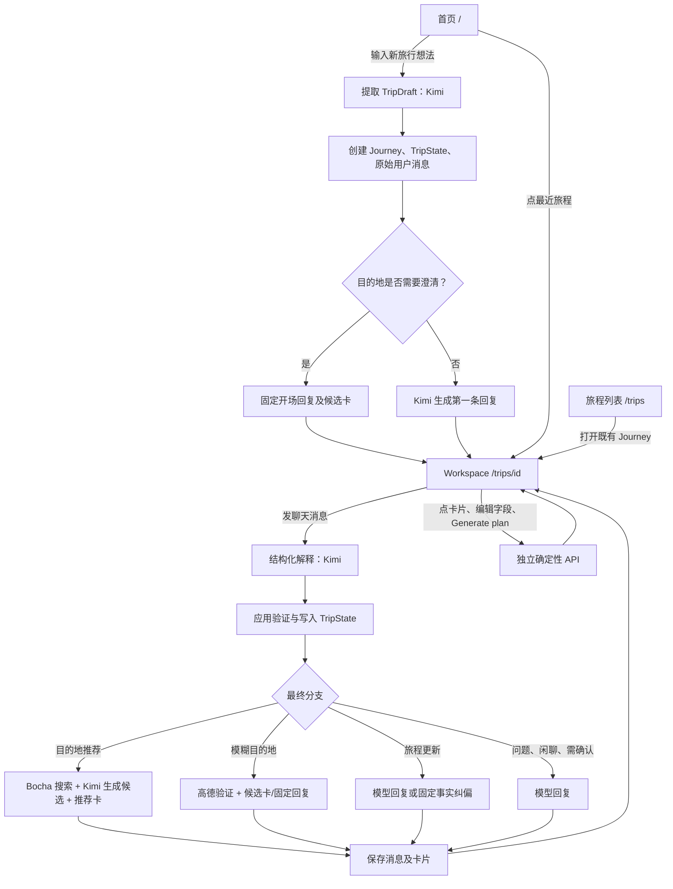
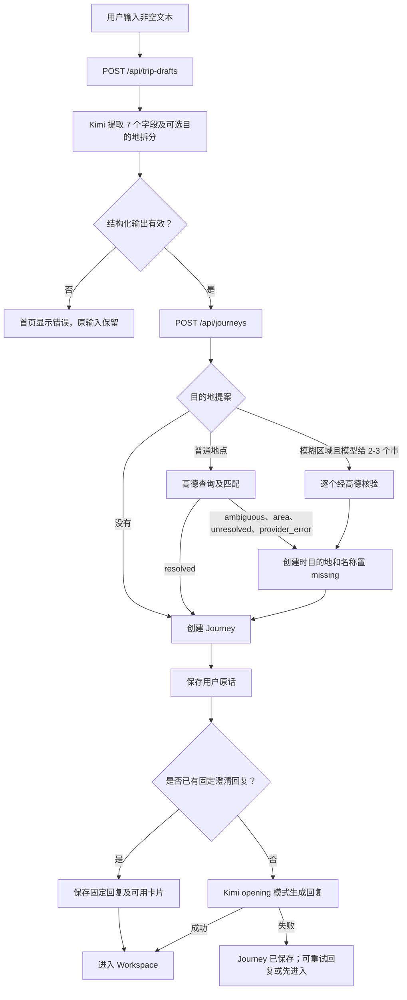
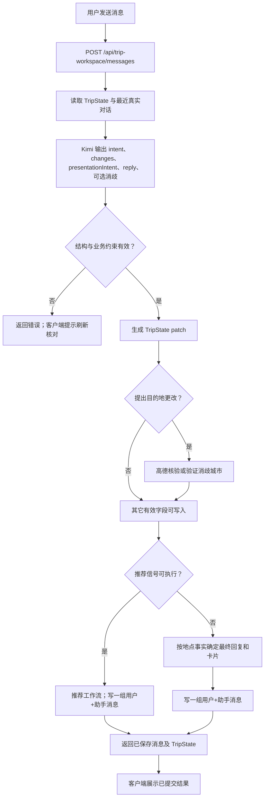

# Meri 当前用户操作流程与回复来源

> 按 2026-09-29 当前工作区源码梳理，包含未提交改动。本文描述源码实际调用路径，不以旧架构文档中的规划为准；未连接线上服务逐条实测。`Home` 指首页 `/`；`Workspace` 指 `/trips/[id]`；Journey 是持久化的旅程。

## 先看全局

**核心边界：**`TripState` 是旅程当前事实；聊天记录、模型建议、推荐卡都不能单独确认目的地。Kimi 负责理解语言并提出结构化建议，应用负责校验、写入、地点核验和卡片选择。普通聊天没有开放式 Agent。[状态模型](../src/domain/trip-state/trip-state.ts)、[Workspace API](../src/app/api/trip-workspace/messages/route.ts)。

## 1. 用户能从哪里进入

| 入口与操作 | 页面/组件 | 到达结果 |
| --- | --- | --- |
| 首页输入一句旅行想法 | [`/`](../src/app/page.tsx) → [NewTripComposer](../src/components/meri-shell/new-trip-composer.tsx) | 创建新 Journey，成功后跳转 `/trips/{id}` |
| 首页点最近旅程卡片 | [RecentJourneys](../src/components/meri-shell/recent-journeys.tsx) | 打开既有 Workspace，不重跑 LLM |
| `/trips` 旅程列表点卡片 | [旅程列表](../src/app/trips/page.tsx) | 打开既有 Workspace |
| Workspace 左侧“新旅程” | [TripWorkspace](../src/components/trip-workspace/trip-workspace.tsx) | 返回首页新建入口 |
| `/trips/new` | [重定向](../src/app/trips/new/page.tsx) | 返回首页 |

Workspace 页面先按访客 cookie 校验所有权，加载 TripState 与已保存消息；无权限/无旅程返回 404，缺少 TripState 显示异常页。刷新时读取已有消息和卡片，**不会仅因刷新重新调用模型**。[页面加载](../src/app/trips/[id]/page.tsx)、[访客身份](../src/platform/identity/guest-identity.ts)、[消息服务](../src/capabilities/conversation/trip-message-service.ts)。

## 2. Home 新建 Journey：输入一句话之后

1. 首页提交后，[客户端模型](../src/components/meri-shell/new-trip-composer-model.ts)先调用 `POST /api/trip-drafts`；[API](../src/app/api/trip-drafts/route.ts)通过 [提取器](../src/capabilities/journey/trip-draft-extractor.ts)调用 Kimi，输出 `name / origin / destination / startDate / endDate / duration / transportPreference`，各字段带 `known / approximate / ambiguous / missing`。提示词在 [trip-draft-prompt.ts](../src/capabilities/journey/prompts/trip-draft-prompt.ts)。此步只是提取数据，**不创建 Journey，也没有回复用户的正文**。
2. 客户端再调用 `POST /api/journeys`，带提取结果和用户原话。[创建协调器](../src/capabilities/journey/create-journey-with-opening.ts)核验目的地：模糊区域按模型建议的 2–3 个市分别向高德求证；普通表达走地点解析。创建代码当前仅把 `resolved` 当作可直接保留。`area`（例如省级地区）、`ambiguous`、`unresolved`、`provider_error` 都会在**新建时**把目的地和推断名称置为 `missing`，并写一条固定澄清回复；若有可展示候选则附卡片。这里与 Workspace 对省级地区的处理不同，见第 4 节。
3. [JourneyService](../src/capabilities/journey/journey-service.ts)创建 Trip、TripState 并保存原始用户消息；状态/消息写入失败时尝试删除 Trip 回滚。新建正常开场走 [OpeningConversationService](../src/capabilities/conversation/opening-conversation-service.ts)：Kimi 使用专用 opening prompt，只能回答，不能提议改状态或推荐卡；开场消息保存后跳转。模型开场失败时 Journey 仍已创建，首页提供“重试 Meri 回复”和“先进入旅程”。[重试 API](../src/app/api/trips/[id]/conversation/initialize/route.ts)会检查当前是否仍适合生成开场，并避免重复写同一条回复。

**回复来源：**普通开场是 Kimi；目的地被拒绝或需消歧时是 [固定文案](../src/capabilities/journey/create-journey-with-opening.ts)，候选来自高德验证。没有消息时 Workspace 还有一条仅用于空界面的[本地占位开场](../src/components/trip-workspace/conversation-panel.tsx)，它不代表保存过的助手消息。

## 3. Workspace 聊天：每条输入如何分流

### 3.1 模型实际决定什么

[解释器](../src/capabilities/conversation/workspace-conversation-interpreter.ts)读取当前 TripState、当日日期/时区和[最近对话](../src/capabilities/conversation/workspace-conversation-context.ts)，要求 Kimi 输出：

| 字段 | 可选值 | 含义 |
| --- | --- | --- |
| `intent` | `trip_state_update` / `question` / `unclear_update_intent` | 是明确修改、提问，还是意图不清 |
| `changes` | 最多 7 个受限字段 | 仅明确更新才可非空；不能重复字段 |
| `presentationIntent` | `none` / `destination_recommendations` | 模型认为这轮是否适合展示目的地推荐；应用还要再次判断 |
| `destinationDisambiguation` | `missing` 或 2–3 个地点表达 | 对“潮汕”一类表达提议较具体的市，应用再向高德求证 |
| `reply` | 非空文字 | 模型写的临时回复；可能成为最终回复，也可能被应用覆盖 |

[Prompt](../src/capabilities/conversation/prompts/workspace-conversation-prompt.ts)规定：有偏好且“去哪”仍开放时倾向推荐；没偏好时自然追问；已定目的地时补旅程信息；天气、价格、开放情况等未接入实时研究的问题不能编造；不能直接写行程。正常聊天另有一个可选 `resolve_location` 工具调用前置步骤，只允许查询**当前 TripState 中原样存放的目的地**；明确的新目的地改动由后续应用核验，不由工具直接写入。[工具边界](../src/capabilities/conversation/tools/resolve-location.ts)、[Kimi 客户端](../src/platform/llm/ai-sdk-kimi-client.ts)。

### 3.2 应用实际决定什么

[领域校验](../src/domain/trip-state/workspace-conversation.ts)拒绝无效结构：`trip_state_update` 必须有改动，其他 intent 不能带改动；只允许 7 个状态字段及合法状态值。验证后才生成用户来源的 patch。目的地要走 [写入前核验](../src/capabilities/destination/post-update-destination-resolution.ts)：

| 地点结果 | 状态行为 | 用户看到什么 |
| --- | --- | --- |
| `resolved`，匹配唯一地点 | 保留目的地 patch；其它字段也写 | 通常用模型回复，附应用固定的 Generate plan 提示 |
| `area`，识别为省级区域 | 保存为 `approximate`，`areas` 只有省、没有具体地点 | 通常保留模型回复；之后仍可在该省内推荐 |
| `ambiguous`，有多个同名/近似地点 | **不写**新目的地；同轮其它字段可写 | 固定“请选择哪一个”，附 `location_candidates` 卡 |
| `unresolved` | 不写新目的地；同轮其它字段可写 | 固定“还没能确认地点”类回复 |
| `provider_error` | 不写新目的地；同轮其它字段可写 | 固定“地点查询暂不可用”类回复 |
| 模型给出 2–3 个消歧表达 | 逐个高德核验；不直接写该目的地；其它字段可写 | 有验证结果时出可多选的城市卡；否则固定失败说明 |
| 用户明确清除目的地 | 允许写成 `missing` | 按模型回复继续；没有地点查询 |

分支优先级由 [workspace-turn-branch.ts](../src/capabilities/conversation/workspace-turn-branch.ts)确定：**推荐回复 > 消歧回复 > 普通更新/问答**。普通更新中，[turn-reply.ts](../src/capabilities/conversation/turn-reply.ts)按真正的地点结果纠正模型先前的假设；地点确认为 `known` 时还拼上固定的 Generate plan 提示。`journey_update` 与 `conversation` 是日志/选择回复的分支名，不代表两个独立的模型。

**一个容易忽略的失败边界：**聊天 API 先可能写 TripState，再运行推荐和保存消息；这些动作不是同一笔跨步骤事务。若后续失败，状态可能已变而本轮消息尚未成功提交。客户端因此显示“发送结果未确认，请刷新核对”。[API](../src/app/api/trip-workspace/messages/route.ts)、[Transport](../src/components/trip-workspace/workspace-chat-transport.ts)。

### 3.3 输入示例与实际路径

下列是**按代码规则推导的示例**，具体 Kimi 输出会变化；模型若没有给预期意图，应用也不会凭文字硬触发该分支。

| 输入及当前状态 | 可能的决策和行为 | 最终回复来源 |
| --- | --- | --- |
| 没目的地：“我喜欢雪山和徒步，想安静一点” | Kimi 给 `question + destination_recommendations`；应用检查地点仍开放；Bocha 搜索、Kimi 生成推荐卡，写入一组消息 | 有卡：**本轮 Kimi 的 reply** + 应用生成卡；无卡：固定“没筛出合适目的地” |
| 没目的地：“我想出去玩” | `question + none`，无状态写入，追问偏好 | Kimi |
| “我想去海南” | `trip_state_update`；高德识别省级 `area`；写 `approximate` 省份；暂无具体地点 | 通常 Kimi；后续推荐只在已定省份内 |
| “我想去云南，想爬山” | 同轮先写省级范围；若 Kimi 同时给推荐信号，应用允许在云南省内出卡 | 有卡时 Kimi reply；卡由推荐工作流给出 |
| “我想去潮汕” | Kimi 提议消歧城市；高德逐个核验；原表达不直接确认为目的地 | 固定消歧文案 + 验证后的城市卡 |
| “我想去朝阳”而高德匹配多个地点 | 不写新目的地；展示匹配结果 | 固定澄清文案 + 高德候选卡 |
| “时间改成十一月底左右” | 只写约略开始时间 | Kimi；无地点副作用 |
| “富良野雪怎么样？” | prompt 要求作为事实问题，不改目的地；未接研究时说明无法核实 | Kimi，受 prompt 约束 |
| “要不富良野？” | prompt 要求作为待确认意图，不改状态 | Kimi |
| “都定好了，可以生成计划了吗？” | 当前聊天没有生成计划分支；prompt 要求不要擅自宣布准备度 | Kimi；用户点按钮才会执行准备度检查 |

## 4. 推荐卡、候选卡和点击后的动作

### 4.1 推荐如何触发

**聊天自动触发：**Kimi 返回 `presentationIntent=destination_recommendations` 还不够。[应用门槛](../src/capabilities/recommendation/destination-recommendation-use-case.ts)要求写入后的目的地仍“开放”（完全缺失，或尚未选具体地点的区域）、没有有效消歧信号，并且本轮提出的目的地改动若存在必须真的写成功。此路径用真实用户消息和历史构造上下文，保存**一条用户消息 + 一条助手消息**，不虚构按钮操作。

**显式按钮：**Journey overview 的 Generate plan 在目的地缺失时会保存一条固定引导消息，内含“帮我推荐 / 我自己选”。“帮我推荐”调用 `POST /api/trips/{id}/destination-recommendations`，先保存一条 `TripUserAction`，再生成和保存助手推荐消息；不新增一条伪用户聊天消息。“我自己选”打开右侧目的地编辑器。[引导 API](../src/app/api/trips/[id]/destination-missing-guidance/route.ts)、[固定引导句](../src/capabilities/conversation/destination-missing-guidance.ts)、[推荐 API](../src/app/api/trips/[id]/destination-recommendations/route.ts)、[会话按钮](../src/components/trip-workspace/conversation-panel.tsx)。显式推荐也可在只有省份、未定具体地点时用；固定引导消息只在目的地完全缺失时由右侧按钮产生。

**推荐工作流的当前实际步骤：**[上下文](../src/capabilities/recommendation/destination-recommendation-context.ts)取 TripState 和最多 10 条/6000 字已保存对话 → [Bocha Discovery Search](../src/platform/search/discovery-search.ts)尝试取最多 8 条搜索结果（搜索失败退化为空结果）→ [Kimi 结构化生成](../src/capabilities/recommendation/destination-recommendation-generator.ts)省份及市/州候选与理由 → [领域校验](../src/domain/location/destination-recommendations.ts)去重、最多 12 个地点 → [工作流](../src/capabilities/recommendation/destination-recommendation-workflow.ts)把建议限制在用户已经选定的省份内，赋卡片 ID。**这条当前调用链没有官方访问检查、风险排序或图片补全**；搜索结果只是启发信息，不能证明开放、安全或可达。卡片只是建议，不能直接改 TripState。

### 4.2 用户点击卡片

| 用户动作 | API 和校验 | 状态与回复 |
| --- | --- | --- |
| 点击推荐城市卡，可多选 | [`destination-recommendation-selection`](../src/app/api/trips/[id]/destination-recommendation-selection/route.ts)只接受已保存在那条助手消息里的卡 ID；按省份组合选中地点；旧卡缺省份则拒绝 | 写 `destination=known` 且带 `areas`；随后做准备度检查并保存[固定选择确认回复](../src/capabilities/destination/destination-selection-reply.ts)。重复点击同一组合会返回原回复；状态已变化则 409 |
| 点击地点歧义候选卡，单选 | [`location-candidate-selection`](../src/app/api/trips/[id]/location-candidate-selection/route.ts)从已保存的助手卡片按索引取候选，不能由客户端任意提供地名 | 写 `destination=known`，保存高德 providerId/坐标；准备度检查后保存固定确认回复。重复选择会去重；状态不符则 409 |

注意：推荐卡选择的写入路径依据**已保存卡片及省份结构**，然后准备度检查把有具体地点的 `areas` 当作已选定；这里并没有在写入前逐个再次调用高德验证推荐地点。地点歧义候选卡的身份则来自先前高德查询。[推荐选择 API](../src/app/api/trips/[id]/destination-recommendation-selection/route.ts)、[准备度规则](../src/capabilities/destination/generate-plan-readiness.ts)。

## 5. 右侧 Journey overview 的直接操作

| 操作 | 实际行为 | LLM / 固定文案 |
| --- | --- | --- |
| 编辑旅程名称、日期、时长、交通偏好 | 客户端构造字段 patch，`PATCH /api/trips/{id}/state`；服务端校验后写 TripState | 不调用 LLM，也不生成聊天回复；失败显示固定错误 |
| 编辑出发地或目的地 | 输入至少 2 字后，防抖请求 `GET /api/locations/suggestions?q=...`；用户点高德建议；同一个 state PATCH 保存选中地点身份 | 不调用 LLM；列表来自高德，保存后不自动产生聊天回复 |
| 点击右侧 Generate plan | `GET /api/trips/{id}/planning-readiness`；目的地缺失时还会保存一次固定引导消息 | 固定准备度文案；**没有生成旅行计划** |
| 点击聊天区 Generate plan | 仅在目的地已是可请求状态时显示；同一准备度 API | 固定准备度文案；**没有生成旅行计划** |
| 返回首页/重新打开 | 读取持久化 TripState 与消息 | 不调用 LLM |
| 首页最近旅程或 `/trips` 列表删除 Journey | `DELETE /api/trips/{id}`，按访客所有权删除；列表把它移走 | 不调用 LLM；确认/错误文案由前端写定 |

相关实现：[右侧面板](../src/components/trip-workspace/expedition-brief-panel.tsx)、[地点编辑器](../src/components/trip-workspace/location-editor.tsx)、[直接状态 patch](../src/components/trip-workspace/trip-state-persistence-model.ts)、[状态 API](../src/app/api/trips/[id]/state/route.ts)、[聊天区 Generate plan](../src/components/trip-workspace/generate-plan-action.tsx)、[准备度显示文案](../src/components/trip-workspace/planning-readiness-model.ts)、[删除 API](../src/app/api/trips/[id]/route.ts)。直接状态 PATCH 是用户操作路径，**不会走聊天目的地解析器**；地点编辑器通过建议选择获得高德身份。

准备度只围绕目的地：缺失、歧义、省级范围、不可识别、供应商故障会返回各自原因；已有具体地点的 `areas` 直接通过，带高德选中身份的已知地点也通过，其他已知目的地才调用高德解析。[规则](../src/capabilities/destination/generate-plan-readiness.ts)、[API](../src/app/api/trips/[id]/planning-readiness/route.ts)。出发地、日期和时长目前不是这个检查的硬性条件。

## 6. 回复到底是谁写的：速查表

| 场景 | 文本来源 | 卡片/数据来源 |
| --- | --- | --- |
| Home 正常开场 | Kimi opening 模式 | 已创建 TripState |
| Home 目的地含糊/无法验证 | 创建协调器固定模板 | 高德解析/消歧验证 |
| Workspace 普通提问、闲聊、未明确的修改 | Kimi `reply` | 无 |
| Workspace 普通字段修改 | 通常 Kimi `reply` | 应用验证并写状态 |
| Workspace 目的地唯一匹配或省级范围 | 通常 Kimi `reply`；唯一确认时应用追加固定计划提示 | 高德解析后的结果 |
| Workspace 目的地多解、未识别、查询故障、城市消歧 | [固定事实文案](../src/capabilities/conversation/turn-reply.ts)替换 Kimi 原回复 | 高德候选/验证后的城市 |
| Workspace 聊天触发推荐 | 有卡时 Kimi 本轮 `reply`；无卡时固定“没筛出” | Bocha 搜索作上下文 + Kimi 候选 + 应用过滤 |
| 点“帮我推荐” | 推荐工作流固定引导句或固定“没筛出” | 同一推荐工作流 |
| 点推荐卡/候选卡 | 固定选择确认句 | 已保存卡片、TripState、准备度检查 |
| 点 Generate plan | 固定准备度/错误文案 | TripState，必要时高德解析 |
| 无消息时的聊天占位 | 客户端固定句，不持久化 | 当前 TripState |

Kimi 接口默认模型 `kimi-k2.6`，可用 `LLM_MODEL` 覆盖；通过 Moonshot 兼容接口调用，相关环境变量见 [AI 客户端](../src/platform/llm/ai-sdk-kimi-client.ts)。LLM 的 JSON、字段值和推荐列表均由应用校验，模型不能生成 React 组件。

## 7. 持久化与几个需要留意的实现差异

- **保存的是什么：**Trip 是 ID/访客所有权；TripState 是 7 个旅程字段；TripMessage 保存真实用户/助手文本及受限卡片 presentation；显式“帮我推荐”另存 TripUserAction。[TripState](../src/domain/trip-state/trip-state.ts)、[TripMessage](../src/domain/trip-message/trip-message.ts)、[TripUserAction](../src/domain/trip-user-action/trip-user-action.ts)。
- **Home 与 Workspace 对省份不同：**Home 新建协调器只保留 `resolved`，所以高德返回 `area` 时会清空初始目的地；Workspace 写入协调器则把 `area` 保存为 `approximate + areas`。这是当前代码可观察到的不一致，不是流程图简化。
- **旧文档已落后：**[ARCHITECTURE.md](ARCHITECTURE.md)仍描述“官方访问检查、排序、图片补全、最多 3 张卡”；目前的[推荐工作流](../src/capabilities/recommendation/destination-recommendation-workflow.ts)是搜索启发 + 模型生成 + 省份过滤，领域上限是 12 个地点。旧文档对可行性/安全核验的说法不能当成现有功能。
- **Generate plan 只是检查：**UI 和回复会说“可以开始生成”，但按钮点击仅返回“规划功能尚未开放”等准备度文案；没有生成计划、路线、天气或研究 Agent 的执行 API。[按钮](../src/components/trip-workspace/generate-plan-action.tsx)、[文案](../src/components/trip-workspace/planning-readiness-model.ts)。
- **推荐卡权威边界：**用户点卡后才写目的地，但这一路径只核对卡片确曾保存，不在写入前逐一复查高德地点身份。后续准备度对有地点的 `areas` 直接判可继续。这点与旧架构文档“选择卡片也要过 Location Provider 验证”不一致。
- **部分成功：**开场模型失败时 Journey 已保存；卡片选择已写状态而确认回复失败时 API 返回 `follow_up_unavailable` 与新 TripState；聊天状态先写而后续消息/推荐失败时需刷新确认。前端都设有对应提示。[创建协调器](../src/capabilities/journey/create-journey-with-opening.ts)、[卡片选择 API](../src/app/api/trips/[id]/destination-recommendation-selection/route.ts)、[聊天 API](../src/app/api/trip-workspace/messages/route.ts)。

### 核心文件索引

| 想找什么 | 文件 |
| --- | --- |
| Home 新建调用顺序 | [new-trip-composer-model.ts](../src/components/meri-shell/new-trip-composer-model.ts) |
| Home 提取 prompt 与 API | [trip-draft-prompt.ts](../src/capabilities/journey/prompts/trip-draft-prompt.ts)、[trip-drafts/route.ts](../src/app/api/trip-drafts/route.ts) |
| 新建目的地核验与开场 | [create-journey-with-opening.ts](../src/capabilities/journey/create-journey-with-opening.ts) |
| Workspace 聊天总控制器 | [messages/route.ts](../src/app/api/trip-workspace/messages/route.ts) |
| 聊天决策 prompt 与 JSON schema | [workspace-conversation-prompt.ts](../src/capabilities/conversation/prompts/workspace-conversation-prompt.ts)、[workspace-conversation-interpreter.ts](../src/capabilities/conversation/workspace-conversation-interpreter.ts) |
| 地点写入、最终回复 | [post-update-destination-resolution.ts](../src/capabilities/destination/post-update-destination-resolution.ts)、[workspace-turn-branch.ts](../src/capabilities/conversation/workspace-turn-branch.ts)、[turn-reply.ts](../src/capabilities/conversation/turn-reply.ts) |
| 推荐生成和触发门槛 | [destination-recommendation-use-case.ts](../src/capabilities/recommendation/destination-recommendation-use-case.ts)、[destination-recommendation-workflow.ts](../src/capabilities/recommendation/destination-recommendation-workflow.ts) |
| 用户点推荐/歧义卡 | [destination-recommendation-selection/route.ts](../src/app/api/trips/[id]/destination-recommendation-selection/route.ts)、[location-candidate-selection/route.ts](../src/app/api/trips/[id]/location-candidate-selection/route.ts) |
| 状态/消息数据库连接 | [journey-service-instance.ts](../src/capabilities/journey/journey-service-instance.ts)、[trip-message-service-instance.ts](../src/capabilities/conversation/trip-message-service-instance.ts) |
