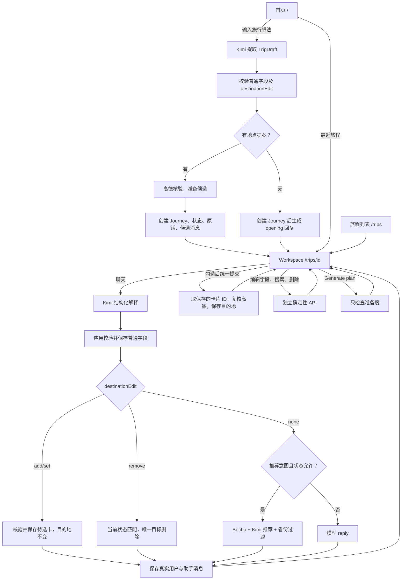
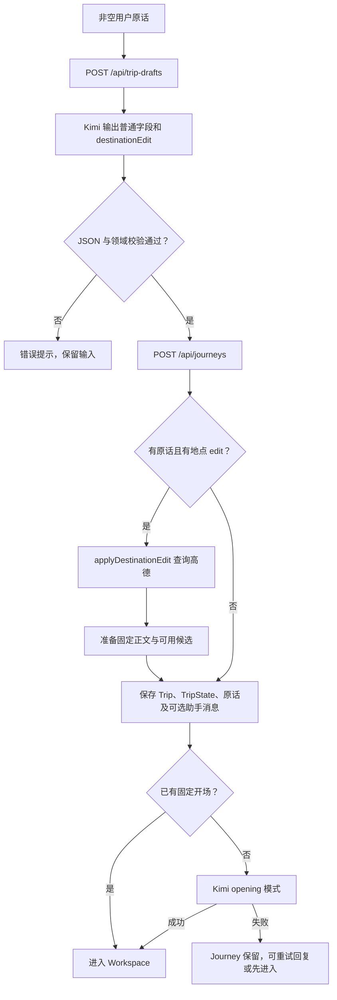
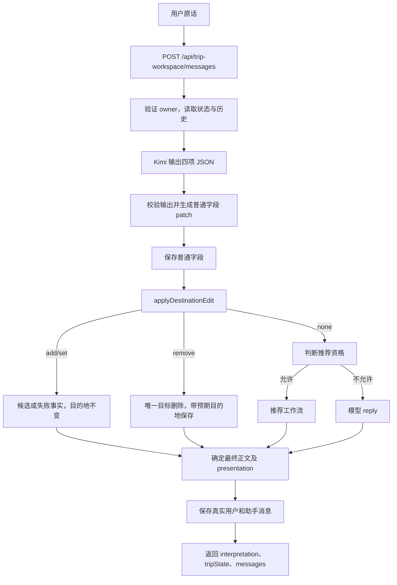

# Meri 当前用户操作流程与回复来源

> 按 2026-10-01 工作区源码核对，包含已落地的 destination 重构和 UI 调整。沿用原有章节、流程图、操作表及代码索引，用于业务追踪与向用户讲解。本文描述实际调用路径；输入示例是按规则推导，未来能力明确标为计划。Home 指 `/`，Workspace 指 `/trips/[id]`，Journey 是持久化旅程。完整目录、分层与逐文件说明见 [CODEBASE_GUIDE.md](CODEBASE_GUIDE.md)。

## 先看全局



**数据权威：**TripState 是当前决定，模型输出是提案，助手卡片是待选项，聊天记录是历史。核验成功不代表用户已经选择；显式提交后的地点才进入正式 destination。删除后不能因为历史里提过就自动恢复。

**谁决定执行什么：**LLM 理解语言并输出受限 JSON；应用校验 JSON、判断可执行分支、调用高德和保存；React 根据受支持的 presentation 渲染。workflow 是我们写的确定性应用流程。Vercel AI SDK 用于模型调用及聊天适配；当前没有 Vercel Workflow 执行器或开放式 Agent 循环。

代码：[TripState](../src/domain/trip-state/trip-state.ts)、[消息模型](../src/domain/trip-message/trip-message.ts)、[聊天 API](../src/app/api/trip-workspace/messages/route.ts)、[AI SDK 客户端](../src/platform/llm/ai-sdk-kimi-client.ts)。

## 1. 用户能从哪里进入

| 入口与操作 | 页面/组件 | 到达结果 |
| --- | --- | --- |
| 首页输入一句旅行想法 | [`/`](../src/app/page.tsx) → [NewTripComposer](../src/components/meri-shell/new-trip-composer.tsx) | 提取草稿，创建 Journey，开场成功后跳转 Workspace |
| 首页点最近旅程 | [RecentJourneys](../src/components/meri-shell/recent-journeys.tsx) | 打开既有 Journey，不重新提取草稿 |
| `/trips` 点旅程卡 | [旅程列表](../src/app/trips/page.tsx) | 打开已有 Workspace |
| Workspace 左侧新旅程 | [TripWorkspace](../src/components/trip-workspace/trip-workspace.tsx) | 返回首页输入入口 |
| `/trips/new` | [重定向](../src/app/trips/new/page.tsx) | 返回首页 |

### 1.1 访客身份、列表与刷新

1. 访客 cookie 提供 ownerGuestId；当前是访客所属 Journey，没有账号协作体系。
2. Workspace 加载先验证 Trip 属于访客，再加载 TripState 和保存的消息。
3. 不存在或不属于访客的 Journey 按 404 处理；Trip 存在但状态缺失属于不完整旅程错误。
4. 刷新读取保存的正文和 presentation，不因刷新重跑 Kimi 或重新生成卡片。
5. JourneySummary 是列表读模型，不作为修改或未来规划的事实基底。

代码：[页面加载](../src/app/trips/[id]/page.tsx)、[访客身份](../src/platform/identity/guest-identity.ts)、[JourneyService](../src/capabilities/journey/journey-service.ts)、[消息服务](../src/capabilities/conversation/trip-message-service.ts)、[列表查询](../src/capabilities/journey/my-journeys.ts)。

## 2. Home 新建 Journey：输入一句话之后



### 2.1 提取阶段：只理解，不保存旅程

[客户端模型](../src/components/meri-shell/new-trip-composer-model.ts)把 trim 后的非空原话作为 `{message}` 提交 [trip-drafts API](../src/app/api/trip-drafts/route.ts)。[TripDraftExtractor](../src/capabilities/journey/trip-draft-extractor.ts)调用结构化模型；[prompt](../src/capabilities/journey/prompts/trip-draft-prompt.ts)规定提取规则；[领域校验](../src/domain/trip-draft/trip-draft.ts)保证合法形状。

草稿包括 name、origin、startDate、endDate、duration、transportPreference 六个普通字段，另有 destinationEdit。目的地不再由模型拼一个包含所有旧地点的 destination.value。

普通字段支持 known、approximate、ambiguous、missing。日期解释使用参考日期和时区；交通 known 值只支持 self_drive、no_self_drive、public_transport、flexible。这一步没有 Journey ID、数据库副作用或助手正文。

### 2.2 创建阶段：地点提案与正式状态分开

客户端提交 `{draft, initialUserMessage}` 到 [journeys API](../src/app/api/journeys/route.ts)。[createJourneyWithOpening](../src/capabilities/journey/create-journey-with-opening.ts)再次校验草稿；有原话且 destinationEdit 不为 none 时，以 missing 目的地为基底执行地点操作。

- add/set 查询地点并生成待选卡，即使唯一匹配也不直接写 destination。
- 有候选时保存固定开场和 presentation，告知选好后提交才会记入旅程。
- 没结果或提供方失败时保存事实说明，不写无法验证的地点。
- 没有上述固定开场时，创建后执行 opening 模式。
- 没有 initialUserMessage 的接口调用返回 not_requested；首页正常路径提供原话。

[initializeTripState](../src/domain/trip-state/trip-state.ts)建立初始状态，目的地初始 missing。草稿中的普通字段可保留；正式目的地由后续用户选择提交产生。

### 2.3 保存、回滚与开场重试

[JourneyService.createJourney](../src/capabilities/journey/journey-service.ts)顺序保存 Trip、TripState、用户原话及可选固定助手消息。状态/消息保存失败时尝试删除 Trip；清理失败保留创建与清理的两份错误。这是补偿回滚，并非整个调用链的一笔数据库事务。

[OpeningConversationService](../src/capabilities/conversation/opening-conversation-service.ts)调用 Kimi opening 模式：只允许 reply，拒绝 changes、目的地 edit 和推荐意图。因此开场不会再次修改已经创建的状态。

模型开场失败后 Journey 仍存在。首页进入 opening_failed，提供“重试 Meri 回复”和“先进入旅程”。重试调用 [conversation/initialize](../src/app/api/trips/[id]/conversation/initialize/route.ts)，服务检查现有消息及开场资格，使用确定的助手消息身份减少重复写入；不会重新创建 Journey。

**回复来源：**普通开场是 Kimi；地点候选/失败开场是应用模板。无保存消息时 [ConversationPanel](../src/components/trip-workspace/conversation-panel.tsx)还可能显示本地占位，它不代表数据库已有助手消息。

## 3. Workspace 聊天：每条输入如何分流



### 3.1 模型实际决定什么

[interpretWorkspaceConversation](../src/capabilities/conversation/workspace-conversation-interpreter.ts)调用一次 generateStructuredOutput，输入当前 TripState、用户原话、参考日期/时区和最近对话。

[历史选择器](../src/capabilities/conversation/workspace-conversation-context.ts)最多取最近 5 轮、6000 字符，先合并连续助手消息，避免选卡确认因没有新用户原话而被遗漏。[conversation-history-content](../src/capabilities/conversation/conversation-history-content.ts)将持久化卡片转成上下文内容。

| 字段 | 合法值/形状 | 用途 |
| --- | --- | --- |
| presentationIntent | none / destination_recommendations | 推荐信号，应用再检查资格 |
| changes | 六类普通字段的修改数组 | field、state、value；不能改 destination 或重复字段 |
| destinationEdit | none / add / set / remove | 本次用户提及的地点操作，不重写整个旧目的地 |
| reply | 非空文字 | 暂定自然回复，可能被应用事实覆盖 |

受限 JSON 示例（按规则构造，不代表某次线上原始输出）：

```json
{
  "presentationIntent": "none",
  "changes": [],
  "destinationEdit": {
    "operation": "add",
    "places": ["梅里雪山"],
    "broadRegion": null
  },
  "reply": "我帮你确认一下梅里雪山的位置。"
}
```

[destinationEdit schema](../src/domain/trip-state/destination-edit.ts)在严格模型输出里要求 operation、places、broadRegion 都出现；校验后的领域 none 只保留 operation，remove 不保留 broadRegion。places 最多 6 个表达、每个最多 80 字符，trim 后去重。

- add 是追加提议，保留现有目的地。
- set 用于首次提及地点，和 add 一样只生成追加卡；已有目的地时也不能清空旧项。只有用户明确表示不去某个已保存地点，才用 remove 删除对应省/市/spot。
- remove 是删除当前保存目标。
- broadRegion 表示潮汕等宽泛区域，places 为模型提出的具体表达，仍需高德验证。

[Workspace prompt](../src/capabilities/conversation/prompts/workspace-conversation-prompt.ts)要求区分明确修改与提问、保留用户决定及具体景点表达、缺目的地时推荐或追问。不允许编造未研究的实时事实或直接写行程。

当前没有 intent、destinationDisambiguation 和旧 resolve_location 前置工具。模型不能生成 providerId、宣称数据库操作成功或生成任意 React/CSS。LLM 判断语义，应用负责执行权限和事实边界。

### 3.2 应用实际决定什么

**行政地名补查：**[LocationService.resolveExpression](../src/capabilities/destination/location-service.ts)先按原词查询。如果返回了 POI，但没有合理匹配，且原词为 2–12 个汉字、不以省/市/区/县/州/镇/乡/村结尾，最多再查询一次“原词＋市”。补查只接受名称精确匹配且 city 或 district 同名的行政地点；酒店、道路等不能替代城市。空结果、已有明确/歧义结果不补查，提供方失败仍报查询故障。例如“香格里拉”的酒店结果可通过“香格里拉市”补查恢复；仍需国内范围检查和显式确认。县级市在当前结构中归到所属地级市/自治州，偏好名称保留提供方行政全名，确认时用全名重新查询，避免再次落到同名酒店。

**结构校验：**解释器拒绝空输出、截断输出、非法 JSON；[领域校验](../src/domain/trip-state/workspace-conversation.ts)要求精确四项顶层键，检查字段名、重复字段、状态和值及交通枚举。missing 的 value 必须为 null，其他普通状态必须有非空 value。

**普通字段：**createTripStatePatchFromInterpretation 将 changes 转成 source=user 的 patch；空数组返回 null。destination 不在普通 changes 中。

**地点执行：**[applyDestinationEdit](../src/capabilities/destination/apply-destination-edit.ts)返回 destination、changed、choices，以及 unresolved、lookupFailed、notInDestination、ambiguousRemovals 等事实，供 route 决定保存和回复。

| 操作/查询结果 | 正式目的地行为 | 用户看到什么 |
| --- | --- | --- |
| none | 不变 | 有资格可推荐，否则模型 reply |
| add/set + resolved | 不变 | 待选卡，唯一地点也需确认 |
| add/set + area | 不变 | 已核验省级候选；选后保存为只有省的目的地，可直接规划，也可继续选城市 |
| add/set + ambiguous | 不变 | 按省/市/景点偏好归并；不同省市分别供选择 |
| add/set + unresolved | 不因该表达改变 | 暂未找到可靠地点 |
| add/set + provider_error | 不因该表达改变 | 查询暂不可用，可重试 |
| 多表达部分成功 | 候选仍未保存为目的地 | 展示成功项，并说明失败表达 |
| remove 唯一匹配 | 删除对应项 | 无失败时可用模型 reply；级联由领域规则执行 |
| remove 多匹配 | 不删这个表达的项 | 要求说明更具体目标 |
| remove 无匹配 | 不删这个表达的项 | 告知当前旅程没有该地点 |
| 多 remove 部分唯一 | 唯一目标可以删除 | 说明已移除可确认项及未处理项 |

add/set 使用 Promise.all 查询表达。解析层保留不同 provider ID，不把不同 POI 认成同一具体位置；生成旅程选择卡时，按省/市/spot 偏好身份归并。三个梅里雪山记录若归属同一省市且表达同一偏好，只出一个城市选择，附「想去：梅里雪山」。这是目的地偏好的合并，不是具体 POI 消歧成功。不同省市、同市不同 spot 仍分别保留。候选数受消息模型上限约束。set 和 add 均生成 mode=add，提交时合并最新状态。旧版本保存的 mode=replace 卡仍按原基底、过期与幂等规则处理；本版本聊天不再生成整体替换卡。

聊天 remove 先匹配当前 areas 的精确名称，无精确匹配才允许唯一前缀；多匹配不能取第一个。UI 删除提交完整省/市/spot 元组，不用模糊前缀。

**实际分支顺序：**[messages route](../src/app/api/trip-workspace/messages/route.ts)先保存普通字段，再运行地点 edit；只有 destinationEdit=none 才进入推荐用例。最终正文按“候选 → 删除歧义 → 删除无匹配 → 查询失败 → 无结果 → 模型 reply”选取，候选正文可包含部分失败说明。推荐用例返回已保存消息时不再重复保存一组。

[workspace-turn-branch](../src/capabilities/conversation/workspace-turn-branch.ts)存在且有单测，但当前 route 没有调用它。这里以实际 route 条件为准，不能把该 helper 描述为正在运行的中央决策器。

**失败边界：**普通字段、目的地删除、推荐查询、消息保存不是同一笔跨步骤事务。后一步失败时前面状态可能已变。客户端因此提示发送结果未确认，需刷新核对。

| 聊天错误 | HTTP | 定位含义 |
| --- | --- | --- |
| 请求/状态无效 | 400 | 未通过输入规则 |
| Journey/状态不存在 | 404 | owner 或持久化读取失败边界 |
| 状态并发冲突 | 409 | 重读后不能安全提交 |
| 模型配置缺失 | 503 | 未配置服务 |
| 模型超时 | 504 | 超过请求时间 |
| 模型请求或输出失败 | 502 | 外部调用/JSON/业务校验失败 |
| 其他错误 | 500 | 未分类失败 |

响应带 requestId，可与结构化日志关联。[Transport](../src/components/trip-workspace/workspace-chat-transport.ts)处理完整响应与客户端状态同步。

### 3.3 输入示例与实际路径

下面是按代码推导的示例；实际提案取决于模型输出，应用不会只靠自然语言关键词绕过解释器。

| 输入及状态 | 预期结构与路径 | 结果 |
| --- | --- | --- |
| 缺目的地：“人少安静，彻底放空” | none + 推荐信号，Bocha/Kimi 推荐 | 有卡用本轮模型 reply，目的地不变 |
| 缺目的地：“想出去玩” | none，无推荐信号 | Kimi 追问，无状态变化 |
| “我想去云南” | add/set，查询省级 area | 待选省卡；提交后为只有省的目的地，已可规划 |
| “云南，想爬山” | 地点 edit 占本轮 | 先确认省，之后可省内推荐；本轮不再自动连跑推荐 |
| 已有浙江福建：“还想去潮汕” | add，broadRegion=潮汕，核验相关市 | 广东城市可多选追加，旧目的地保留 |
| 已有云南后说“我想去青岛” | add；模型误用 set 也生成 add 卡 | 确认后保留云南并追加山东/青岛 |
| “想去梅里雪山” | 保留表达并查真实行政归属 | 确认后城市含 spots=[梅里雪山]，名称不被自治州吞掉 |
| “朝阳”返回多个地点 | ambiguous，保留不同 provider 身份 | 用户区分候选，不自动取第一项 |
| “不去潮州了” | remove 当前保存名 | 唯一目标删除，最后一个城市删除后省仍在 |
| “不去梅里雪山了” | remove 当前 spot | 删除 spot，保留城市和省 |
| “时间改到十一月底左右” | startDate approximate | 普通字段变化，Kimi reply |
| “梅里雪山现在开放吗” | 应识别为问题 | 地点核验不能当成开放证据 |
| “可以生成计划了吗” | 普通 reply | 聊天无计划执行分支，按钮只检查准备度 |

## 4. 推荐卡、候选卡和点击后的动作

### 4.1 推荐如何触发

**国内服务范围：**当前只提供中国境内旅行建议。草稿、开场、聊天和推荐提示词明确该范围，不主动询问“国内还是国外”；纯境外请求应说明范围且不提出目的地增改或推荐卡。提示词约束不等于普通正文经过地理核验。[domestic-destination-scope](../src/domain/location/domestic-destination-scope.ts)维护 34 个省级行政区的完整名称和常用简称；这是服务范围校验，不是地点归属映射，也不承诺提供方能核验每一个城市/景点。模型推荐 schema 的 province 使用完整名称枚举，运行时校验再次检查名单；含不支持省份的整批输出作为无效模型输出处理，不创建卡片，沿用推荐失败路径。城市名称仍在用户确认时核验，不能仅凭模型写了一个国内省名就保存。

**聊天自动触发：**presentationIntent=destination_recommendations 只是模型信号。[shouldCreateConversationalRecommendations](../src/capabilities/recommendation/destination-recommendation-use-case.ts)还要求 destinationEdit=none，且 [isDestinationOpenToRecommendations](../src/domain/trip-state/trip-state.ts)允许当前状态：missing 或没有选城市的省范围。已定城市不能因推荐信号被替换；legacyText 不作为已验证省范围。

**没有推荐按钮：**推荐只从聊天触发。缺目的地时，聊天下方的 Generate plan 不可用，悬停或聚焦时提示用户：在对话里说出想去的地方、对 Meri 说“帮我推荐几个地方”，或点击提示里的链接打开右侧目的地搜索（见 5.4）。旧版“帮我推荐 / 我自己选”引导消息及其 API 已删除；旧旅程历史里保存的那条引导消息仍按普通助手消息显示，不再带按钮，[其稳定 ID](../src/capabilities/conversation/destination-missing-guidance.ts) 只用于开场判断时跳过它。

**实际推荐流水线：**

1. [构造上下文](../src/capabilities/recommendation/destination-recommendation-context.ts)：TripState、最多 10 条/6000 字符对话；追加当前真实原话并使用 source=conversation（唯一入口），来源标记只存在于本次调用上下文。
2. [Discovery Search](../src/platform/search/discovery-search.ts)：Bocha 取最多 8 条启发信息，失败退化为空搜索上下文。
3. [推荐生成器](../src/capabilities/recommendation/destination-recommendation-generator.ts)：Kimi 输出省、市/州和理由。
4. [领域校验](../src/domain/location/destination-recommendations.ts)：形状校验、去重、最多 12 个地点。
5. [workflow](../src/capabilities/recommendation/destination-recommendation-workflow.ts)：withinSettledProvinces 按规范化省名限制已定省，并采用用户保存的省名拼写，给卡项赋 ID。
6. 保存 destination_recommendations presentation，UI 适配为统一多选卡。卡项仍是建议，提交时才高德复核。

该执行链没有访问检查、风险排序或图片补全。搜索上下文不能证明开放、安全或可达。搜索失败可降级，模型失败仍可能令请求失败。

### 4.2 用户点击卡片

[DestinationChoicesCard](../src/components/trip-workspace/destination-choices-card.tsx)按省分组，逐项勾选后统一提交“添加所选”；历史 replace 卡提交“替换为所选目的地”，新聊天的 set/add 均生成追加卡。没有逐行添加按钮。勾选只改变本地 picked，不写服务器。

| 动作/状态 | UI 判定 | 结果 |
| --- | --- | --- |
| 多选 | 记录暂选 ID 并显示数量 | 一次提交整组 |
| 第二轮新城市 | 按候选身份判断，不按整个 destination.state 禁用 | 可以继续追加广东等地点 |
| 已有市的新 spot | 检查 province/city/spot 元组 | 市存在仍可加新景点 |
| 已经添加 | 以当前 TripState 判断：add 模式勾选并锁定，名称后显示“已在行程”；只读卡同样勾选当前仍在行程中的地点 | 不重复；replace 可选已有城市 |
| 同省市、同景点偏好的多个 POI | 按目标省/市/spot 分组 | 显示一个城市主项，附景点偏好，具体位置在规划阶段再确认 |
| 同名但不同省市 | 目标行政归属不同 | 保留独立选择，不仅按名称合并 |
| 旧卡无可靠身份 | legacyUnverified | 禁用，提示重新搜索 |
| 任一选择正在保存 | selectionInFlight + pending | 暂停全部聊天选择卡，避免重入 |
| 保存失败，且状态未确认写入 | 最新有效卡显示可重试错误 | 不伪称已添加 |
| 已确认/继续聊天/后续新卡 | 原卡变成只读 | 禁用复选框和提交，显示“历史选项，仅供查看” |
| 点击 Generate plan，或在其提示里打开目的地搜索 | 立即关闭当前卡的本地操作资格 | 新返回的候选卡按新消息判断资格 |
| replace 的目的地基底已变化 | 比较 baseDestination 和当前 destination | 原卡只读，不能覆盖新的决定 |

[UI adapter](../src/components/trip-workspace/trip-message-ui-adapter.ts)兼容新 destination_choices、旧 destination_recommendations 和旧 location_candidates。旧独立 location-candidate-selection API 已移除。

[destination-choice-identity](../src/domain/trip-message/destination-choice-identity.ts)定义偏好身份和历史卡分组。新卡的城市偏好 ID 由省/市/spot 构造，不依赖某条 POI。旧卡显示归并时保留组内全部原 ID，提交仍从保存的 offer 验证，不能伪造新 ID。暂选数量按显示行计数。

旧卡一组多个 ID 提交时，服务端先确认它们都属于原 offer，再把同一省/市/spot 合成一次偏好核验，避免对相同表达重复查询高德。不会合并不同省市或不同景点意图。

卡片资格由 [ConversationPanel](../src/components/trip-workspace/conversation-panel.tsx) 的 offerIsActive 判断：必须是消息列表最后一条，未在本地关闭，且 replace 基底未变化。正在聊天、推荐或保存时暂停选择；保存期间暂停发送聊天，避免本窗口同时提交两种决定。确认成功立即关闭原卡；follow_up_unavailable 也关闭，因为状态已经保存，并显示刷新核对提示。刷新后按持久化消息顺序恢复资格，后面已有确认或新对话的卡保持只读。本地按钮关闭记录只在当前页面有效，不将只读准备度查询当作新的持久化对话。

#### 请求与服务器验证

统一 [POST /api/trips/{id}/destination-recommendation-selection](../src/app/api/trips/[id]/destination-recommendation-selection/route.ts)只接受精确两键 body：

```json
{"messageId":"已保存助手消息 ID","destinationIds":["候选 ID 1","候选 ID 2"]}
```

服务端不信任客户端传入地名、行政区、spot 或 verified 标记。实际顺序：

1. 校验访客与 Journey 所有权，messageId 非空，destinationIds 非空且无重复。
2. 从本 Journey 保存的助手消息取 offer，每个 ID 必须属于它。
3. 检查消息顺序：非最后一条 offer 且没有同组合确认记录，返回 409、code=offer_expired。replace 首次检查 baseDestination；已变化则 409。
4. [verifyDestinationChoice](../src/capabilities/destination/verified-destination-choice.ts)重新高德查询所选项。新偏好 ID 校验查询结果中是否存在相同省/市/spot 的合理匹配，不能跨行政区保存，也不能把机场等相关 POI 当景点。旧 provider ID 仍核对身份；旧随机推荐 ID 需精确规范名匹配，多个记录若都代表同一个省市且不是景点，可确认该城市。已验证省级合成项有专门分支。
5. 任一选中项核验失败则整批 409，不部分保存。

   国内范围也在 verifyDestinationChoice 中检查，包括历史卡及省级合成 ID 的快捷分支；不支持省份返回 unresolved，再由接口按核验失败返回 409。新省/市/spot 必须通过范围与现有身份核验，不能借旧卡写入境外地点。
6. 查询结束重读最新 TripState；同组合已有确认且当前结果仍匹配时返回原确认、不写状态。否则再次读取消息，若有后续消息或该组合已消费，返回 offer_expired，防止查询期间继续聊天后旧卡落库。未过期时：add 合并最新 areas；replace 再检查基底，从空 areas 构造整体替换。
7. 按 offer 顺序处理，使请求 ID 顺序变化仍一致；省市合并、spot 同名去重。
8. 带 expectedDestination 保存，避免覆盖查询期间的目的地修改。
9. [destinationSelectionReply](../src/capabilities/destination/destination-selection-reply.ts)按保存后的准备度生成固定确认，保存助手消息。
10. 返回 `{tripState,assistantMessage}`，客户端同步聊天与右侧。

#### 重试、过期与保存一半

- [确认 ID](../src/capabilities/conversation/destination-selection-message-id.ts)由 Journey、原消息及所选组合确定，ID 顺序变化不会产生新确认身份。
- 已有确认且所选仍存在时 add 可返回原回复；replace 还要求当前整个目的地与这次替换结果一致。
- 确认存在不表示可以忽略后来删除/替换；旧 add 不能恢复后来删除的地点，旧 replace 不能覆盖新的决定。已消费卡不能换一组选项再次提交。客户端收到 offer_expired 后锁定卡片，提示刷新或重新搜索。
- 状态已保存但确认失败返回 500、code=follow_up_unavailable 和已保存 tripState。[客户端异常](../src/components/trip-workspace/workspace-conversation-model.ts)先同步真实状态，关闭卡片，再显示“目的地已保存，但确认回复未完成”的刷新提示。
- 非法 body 为 400；无权限/消息/选项不存在 404；核验、基底或并发冲突 409；其他保存失败 500。

## 5. 右侧 Journey overview 的直接操作

| 操作 | 实际行为 | LLM/聊天副作用 |
| --- | --- | --- |
| 修改名称 | 文本编辑后 [state PATCH](../src/app/api/trips/[id]/state/route.ts)，校验普通字段 | 无 LLM，无聊天正文 |
| 选择交通偏好 | 一次点选四个选项之一，再点已选项清除；state PATCH | 无 LLM，无聊天正文 |
| 选择“何时” | [TripDatesField](../src/components/trip-workspace/trip-dates-editor.tsx)范围日历 + 天数步进器；state PATCH 只发送用户选的值，服务器补算第三个 | 无 LLM，无聊天正文 |
| 修改出发地 | [LocationEditor](../src/components/trip-workspace/location-editor.tsx)、[suggestions API](../src/app/api/locations/suggestions/route.ts)、选中后 state PATCH | 仍是 origin 身份结构，不走 destinationEdit |
| 展开目的地搜索 | 目的地行右侧“＋ 添加”（展开后变“收起”） | 本地展开，无状态写入 |
| 搜索城市/景点 | GET /api/trips/{id}/destinations?q=… | 高德，无 LLM，无消息 |
| 添加搜索结果 | POST 同路径 `{query,id}` | 重查身份后保存，无助手消息 |
| 删除省、市、spot | DELETE 同路径 `{province,place,spot}` | 确定性级联，同步状态 |
| 清除旧文本 | DELETE `{legacy:true}` | 删除 legacyText，保留已添加 areas |
| Generate plan（唯一，位于聊天下方） | [GeneratePlanAction](../src/components/trip-workspace/generate-plan-action.tsx) 调用 [planning-readiness API](../src/app/api/trips/[id]/planning-readiness/route.ts) | 只检查，不执行规划；右侧面板不再有 Generate plan |
| 返回、重开、刷新 | 读持久化状态与消息 | 不调用模型 |
| 删除 Journey | [DELETE /api/trips/{id}](../src/app/api/trips/[id]/route.ts)，校验 owner | 列表反馈，不调用模型 |

### 5.1 普通字段编辑体验

[ExpeditionBriefPanel](../src/components/trip-workspace/expedition-brief-panel.tsx)按“从哪出发 → 去哪 → 何时 → 怎么去”排列：出发地、目的地、何时、交通偏好，旅程名称放最后。不再显示“N / 7 已理解”计数、示意封面、重复的目的地/日期/交通摘要和“即将开放”快捷按钮。

每行状态由 [field-certainty](../src/components/trip-workspace/field-certainty.tsx)统一为 18px 圆形：known 实心绿圆带勾；missing 空心灰圈；approximate 琥珀色圈内一点，并在值后显示“大致”；ambiguous 红褐色圈内“!”，并显示“待确认”。完整状态文字仍以屏幕阅读器可读的隐藏文本提供。聊天选择卡的复选框保持圆角方形，表示“可勾选”，与状态圆区分。

- 旅程名称：文本编辑，Enter/失焦提交，Escape 取消。
- 出发地、何时和旅程名称共用浅绿圆角铅笔编辑入口：浅绿图形区域 30px、图标 15px；字段值与图标仍是同一个至少 44px 高的按钮，触屏可点整行。悬停显示具体编辑提示并轻微划动一次，按下轻微缩小，键盘聚焦及浮层打开时加深底色；减少动态效果偏好下关闭动画。保留各字段原有编辑与保存方式。
- 交通偏好：四个选项（自驾、不自驾、公共交通、灵活）一次点选，再点已选项清除为 missing；Meri 从对话记下的近似原话（如“可能自驾吧”）显示在选项下方，直到用户点选。
- 何时：一行概括开始、结束和时长，例如“10月1日 → 10月7日 · 7天”；近似原话原样显示并标“大致”。点开为范围日历（宽屏两个月、窄屏一个月，今天之前不可选）：第一次点为开始、第二次点为结束，结束早于开始时改为新的开始；选完两端才保存。只选了开始就填天数或关闭浮层，会连同开始一起保存。天数可用 −/+ 或直接输入（1–366）。“清除日期”把三项都设为 missing。
- 成功采用服务器状态，失败显示错误。[createDirectTripStatePatch](../src/components/trip-workspace/trip-state-persistence-model.ts)与 [createTripDatesPatch](../src/components/trip-workspace/trip-dates-model.ts)构造 source=user 修改；客户端及服务端均禁止通过通用 PATCH 改 destination。

收起详细字段时保留目的地和何时。页头日期行与“何时”使用同一 [tripDatesSummary](../src/components/trip-workspace/trip-dates-model.ts)；旅程标题等由 [workspace-presentation](../src/components/trip-workspace/workspace-presentation.ts)派生，不是另一份事实。

**日期补算规则：**开始、结束、时长描述同一段时间，任意两项确定第三项，天数按含首尾计算（1号到7号为 7天，即 7天6晚）。[deriveTripDates](../src/domain/trip-state/trip-dates.ts)在 [applyTripStatePatch](../src/domain/trip-state/trip-state.ts)中执行，因此右侧编辑和聊天修改都遵守同一规则：

| 本次修改 | 已有 | 补算 |
| --- | --- | --- |
| 开始 + 结束 | — | 时长 |
| 开始 + 时长 | — | 结束 |
| 结束 + 时长 | — | 开始 |
| 只改开始 | 时长 | 保持时长，移动结束 |
| 只改开始 | 结束（无时长） | 时长 |
| 只改结束 | 开始 | 时长 |
| 只改结束 | 时长（无开始） | 开始 |
| 只改时长 | 开始 | 保持开始，移动结束 |
| 只改时长 | 结束（无开始） | 开始 |

只有 state=known 且格式精确的值参与：日期为真实日历日 `YYYY-MM-DD`，时长为 `N天`（可带“M晚”）。“周末”“十月底”“大概一周”等近似或非精确写法不参与，也不会被改写；结束早于开始时不补算。补算出的值 source=system。已保存的旧旅程不回填，下次修改日期时才补算。对话模型的字段说明要求精确天数写成 `N天`（“玩七天”→“7天”）。

### 5.2 目的地搜索、核验、保存

目的地标题行右侧是“＋ 添加”按钮，采用与铅笔入口同色的浅绿圆角矩形（高 30px、宽 66px、圆角 8px）。展开后显示“− 收起”，宽度不变；悬停、键盘聚焦和展开时底色加深，按下轻缩至 0.97；减少动态效果偏好下关闭动画。其下横跨整行，每个省一块浅底区域：省名在左、删除省的 ✕ 统一在右；城市为带 ✕ 的标签，想去的景点以带定位图标的浅色标签紧跟在所属城市后。没有城市的省显示“全省”标签和“规划时按整省考虑”，表示整省范围的目的地，而不是未完成项。展开后搜索横跨字段行。手动搜索仍用单个结果添加，聊天则多选统一提交。

- 至少 2 字开始查询，250ms 防抖，新输入/收起取消旧请求；已取消响应不得覆盖新列表。
- [picksFromSearch](../src/capabilities/destination/resolve-destination-place.ts)过滤省份缺失或不在国内名单内的结果；POST 重查后使用同一过滤，无法核验则返回 409，不写入目的地。聊天地点解析也执行相同范围检查。已有历史记录保持可读、可删除，不自动清理或搬到其他省份。
- [destinations API](../src/app/api/trips/[id]/destinations/route.ts)限制表达 2–80 字符，最多返回 12 项，GET 响应 no-store。
- 候选提供 id、name、province、city、spot、detail，前端 Zod 校验，spot 必须有 city。
- 详情可显示规范名称差异、区县及地址；无法区分的同名结果要求细化搜索。
- POST 用 query 和 id 重新查高德，身份消失返回 409，不信任缓存候选。
- 核验后重读最新状态再合并；busy/inFlight 防重入，成功使用返回 TripState，没有乐观假保存。
- 已有城市但新 spot 未添加仍可保存；追加时保留待确认旧文本。

### 5.3 层级、级联与具体景点偏好

正式 destination 示例：

```json
{
  "state": "known",
  "source": "user",
  "areas": [
    {"province":"云南省","places":[{"name":"迪庆藏族自治州","spots":["梅里雪山"]}]},
    {"province":"广东省","places":[{"name":"潮州市","spots":[]}]},
    {"province":"福建省","places":[]}
  ]
}
```

[resolveDestinationPlace / picksFromSearch](../src/capabilities/destination/resolve-destination-place.ts)取得高德省市父级。匹配城市本身时不建 spot；具体 POI 进入所属市的 spots，适当保留用户表达，否则采用规范名。直辖市以省名作市级父项，UI 显示“市内”标签避免重复。

[destination-areas](../src/domain/trip-state/destination-areas.ts)纯函数负责：

| 删除元组 | 影响 |
| --- | --- |
| province + place=null + spot=null | 删除省及所有城市/景点 |
| province + place + spot=null | 删除市及其 spots，保留省 |
| province + place + spot | 只删景点，市与省保留 |
| 最后一个城市删除 | 保留省，表示整省范围的目的地，仍可规划 |
| 所有省删除且无 legacyText | destination 回到 missing |

最终 spots 是名称字符串，不含 provider ID/坐标。聊天卡选择城市及景点偏好，使用偏好身份，不展示某条 POI 地址来暗示已选精确位置；手动搜索和历史原始候选可保留 provider 身份与地址，确认后也不复制进 spots。未来规划须重新查询具体地点。spots 表示用户想去，不表示强制行程或已经验证开放/安全/可达。

城市删除连带删 spots；未来规划读取当前 TripState，不能从历史聊天恢复这些偏好。历史消息保留是对话记录，不是当前意图清单。

### 5.4 Generate plan 当前只检查准备度

[evaluateGeneratePlanReadiness](../src/domain/trip-state/planning-readiness.ts)是纯状态判断，没有高德调用：

| 当前目的地 | 返回 | 下一步 |
| --- | --- | --- |
| missing | destination_missing | 按钮不可用；悬停/聚焦提示三种添加途径 |
| 存在 legacyText | destination_unverified | 按钮不可用；提示重新搜索添加或清除旧记录 |
| 已有省（无论是否选了市）且无旧文本 | canProceed=true，destination=selected | 可点击，提示规划功能尚未开放 |

出发地、日期、时长、交通不是当前硬门槛。只有省、没有市也算已有目的地，规划会以整省为范围；只有旧文本未确认时不能规划。

按钮始终显示。不可用时使用 `aria-disabled` 而非 `disabled`，保持可聚焦，使键盘用户也能读到提示；提示卡位于按钮所在容器内，指针从按钮移到提示上不会关闭，可点击其中的“在旅程信息里搜索并添加目的地”。该链接通过 [TripWorkspace](../src/components/trip-workspace/trip-workspace.tsx) 递增编辑器打开请求，右侧 [DestinationEditor](../src/components/trip-workspace/destination-editor.tsx) 重新挂载为展开状态并自动聚焦搜索框。点击可用按钮时的检查结果仍只在按钮下方显示，并随目的地变化失效。

[准备度 UI 模型](../src/components/trip-workspace/planning-readiness-model.ts)将结果关联 destination 快照。目的地改变后旧准备度不再展示，避免新决定沿用旧检查结果。

### 5.5 旅程列底部：地球装饰与小熊

右侧列在 Journey overview 下方依次是装饰地球和小熊：

- [JourneyGlobe](../src/components/trip-workspace/journey-globe.tsx)改写自 cult-ui 的 Illustration Globe（MIT），纯 SVG 线框半球，光点沿经线流向节点。节点数等于已选地点数（有市的按市计，只有省的按 1 计，最多 6 个），只为“看着好看”，不表示真实地理位置，没有坐标、没有地图功能。系统要求减少动态效果时只显示静止节点。
- [MeriWorld](../src/components/companion/meri-world.tsx)的小熊在桌面端固定在列底部（滚动时保持可见），旁边气泡显示一句话（见第 6 节速查表），`aria-live=polite` 让读屏软件播报变化。聊天面板把当前活动（idle / thinking / error：发送中或选卡保存中为 thinking，发送结果未确认或选卡保存失败为 error）上报给 [TripWorkspace](../src/components/trip-workspace/trip-workspace.tsx)，再传给小熊。
- 小熊是坐在营地小桌（格子桌布）后的像素精灵图：[bear-sprites.png](../public/companion/bear/bear-sprites.png) 含站着、坐下、看地图、放下/拿起地图、吃饭团、站起来、欢呼、担心 9 个动画共 42 帧，由 [生成脚本](../assets/companion/bear/generate_bear_sprites.py)从同一张插画合成，以 2 倍整数缩放显示。
- 做什么由 [bear-behavior](../src/components/companion/bear-behavior.ts)决定：气泡的状态同时作为“反应”——出错时站起来担心，Meri 回复时坐着认真看地图（站着则原地等），可以生成计划时站起来欢呼一次（旅程内容再变化才会再欢呼）。其余时间按权重随机：看地图 45、站着 25、吃饭团 20、放空 10，同一活动最多连续两次，吃完 60 秒内不再吃，坐着时更愿意继续坐着。姿势变化总是播放过渡（坐下、放下地图等），不瞬移；新反应在下一帧接管，但不打断正在进行的过渡。
- [CompanionBear](../src/components/companion/companion-bear.tsx)负责计时播放；标签页隐藏时暂停、回来接着播；系统要求减少动态效果时只显示坐着看地图的一帧。
- 宽度 ≤800px 时小熊不固定，随内容排在列尾。

## 6. 回复到底是谁写的：速查表

| 场景 | 正文来源 | 卡片/状态来源 |
| --- | --- | --- |
| Home 普通开场 | Kimi opening reply | 初始 TripState |
| Home 地点候选/失败 | createJourneyWithOpening 固定模板 | 高德及 applyDestinationEdit |
| 普通提问、闲聊、普通字段修改 | Kimi reply | 校验后的普通 patch |
| 地点 add/set 候选 | messages route 固定说明 | 高德候选，正式目的地不变 |
| 地点未找到/查询失败 | route 固定事实说明 | 无结果/故障事实 |
| remove 成功无失败项 | Kimi reply | 实际删除；成功措辞仍依赖模型 |
| remove 歧义/无匹配 | route 固定说明 | 当前保存状态匹配结果 |
| 聊天推荐有卡 | 本轮解释 Kimi reply | 另一次 Kimi 推荐生成、Bocha 上下文及应用过滤 |
| 聊天推荐无卡 | workflow 固定失败正文 | 无可展示建议 |
| 聊天选卡提交成功 | destinationSelectionReply 固定确认 | 保存后状态和准备度 |
| 右侧直接编辑/搜索/删除 | 固定加载、按钮、错误提示 | 不新增聊天正文 |
| Generate plan | planningReadinessMessage 固定句 | 状态检查，不生成行程 |
| 右下角小熊的一句话 | [companionStatus](../src/components/companion/companion-status-model.ts) 固定句 | 由当前 TripState 与聊天活动决定，不调用模型：出错 > 思考中 > 可生成（并列出可选的缺项：出发地、出行时间、交通方式）> 缺目的地/旧目的地待确认 |

[AI SDK 客户端](../src/platform/llm/ai-sdk-kimi-client.ts)默认 kimi-k2.6，LLM_MODEL 可覆盖；MOONSHOT_API_KEY 认证，MOONSHOT_BASE_URL 可覆盖地址。默认超时 60 秒，maxRetries=0。仓库默认配置不等于实时服务保证。

[WorkspaceChatTransport](../src/components/trip-workspace/workspace-chat-transport.ts)取得服务端完整 JSON 后适配 useChat，替换临时用户 ID、同步真实状态。[conversation-reveal](../src/components/trip-workspace/conversation-reveal.ts)提供客户端逐字显示；这不代表 API 正在逐 token 流式生成或保存。

## 7. 持久化与几个需要留意的实现差异

### 7.1 各记录的职责

- Trip：Journey 身份、owner、生命周期。
- TripState：当前七类字段，目的地省市/景点；不包含 UI 布局决定。
- TripMessage：真实用户/助手文本，助手可带受限 presentation，刷新重读。
- 推荐操作：只从聊天触发（source=conversation），未定义独立持久化实体；历史 `trip_user_actions` 表由 [0007](../drizzle/0007_trip_user_actions.sql) 创建、[0009](../drizzle/0009_drop_trip_user_actions.sql) 定义删除，当前 schema 不包含该表。具体环境是否执行迁移需另行检查。
- JourneySummary：列表投影，不能作为修改基底。

当前的短期上下文来自最近 5 轮/6000 字符（推荐上下文最多 10 条/6000 字符）和当前 TripState。数据库里的完整聊天记录可刷新恢复，但并非每次全部发送给模型；尚未实现跨旅程长期偏好记忆、对话摘要记忆或检索式 memory。本轮国内范围变更未扩大历史窗口。

数据库定义：[schema](../src/platform/persistence/database/schema/index.ts)。状态仓库：[postgres-trip-state-repository](../src/platform/persistence/postgres/postgres-trip-state-repository.ts)。

### 7.2 并发写入与比较并交换

[updateTripState](../src/capabilities/journey/journey-service.ts)每次读最新状态、应用 patch，再 compareAndUpdate，最多尝试 3 次。普通字段冲突重读重算，保留并发新增目的地，避免用旧整个状态覆盖。

目的地变更传 expectedDestination，重读后与预期不同则 TripStateConflictError/409；不能重套旧目的地 patch。聊天删除、手动变更和选卡提交都走这个边界。

[Postgres CAS](../src/platform/persistence/postgres/postgres-trip-state-repository.ts)读取原始 JSON、验证领域对象与预期状态，再用原始 JSONB 作 UPDATE 条件，检查返回 ID。即使旧 JSON 在读取时被适配，也能原子阻止旧状态覆盖新写入。

生产 Postgres 和内存仓库实现 CAS；接口仍允许没有 compareAndUpdate 的测试替身退回 update，不能把替身路径当生产并发保护。

### 7.3 旧数据与实现局限

旧字符串 places、旧卡片 presentation 在领域读取边界适配。旧 free-text destination.value 保留为 known、areas=[]、legacyText；显示待确认，不把景点强转为城市。

追加已核验地点保留 legacyText，明确清除旧记录才移除；用户提交 replace 整体替换则采用新目的地。没有清库或新增地理实体数据库。

当前限制：

- 聊天状态与消息不是同一跨步骤事务，失败需刷新核对。
- 选卡组合有确认身份与去重，普通聊天/推荐 POST 还无全局重试幂等保证。
- 手动路由 ownerAndTrip 把加载异常统一当未找到，不能由 404 区分数据库故障。
- 最终 spot 按名称保存/去重，不能单靠 TripState 区分两个同名 POI，未来须再核验。
- 手动搜索的同名不可区分项仍禁用；聊天只确认省市及景点偏好，精确 POI/地图消歧留到规划阶段。
- 未实现删除撤销、省内限定搜索、Research Agent 或真正计划生成。
- 通用 [state PATCH](../src/app/api/trips/[id]/state/route.ts) 仍接受领域校验通过的 destination patch，没有统一地点核验；前端普通字段模型拒绝直接编辑目的地，不等于服务端限制。该 route 当前也未将 TripStateConflictError 单独映射为 409；专用目的地 route 的并发响应不能泛化到它。

### 7.4 下一版 Generate Plan 的交接边界（计划）

未来规划应从当前 TripState 取得省范围、已选城市、spots 偏好及日期/交通。只有省的目的地以整省为范围、旧文本需重新确认，均有明确处理规则；未提交候选不能当已选，已删除景点不能从历史恢复。

生成前重新核验 POI，保存证据和新鲜度，再研究交通、天气、开放/访问与风险。准备度通过不代表这些事实已成立。执行、失败恢复、研究预算及持久化规划产物尚未接入；本轮只记录边界，不预先实现框架。

### 核心文件索引

| 业务/操作 | 文件 | 追踪细节 |
| --- | --- | --- |
| Home 提交和失败重试 | [composer model](../src/components/meri-shell/new-trip-composer-model.ts) | 两次请求、phase、导航 |
| 草稿提取 | [extractor](../src/capabilities/journey/trip-draft-extractor.ts) | 模型 JSON 与校验 |
| 创建开场协调 | [create-journey-with-opening](../src/capabilities/journey/create-journey-with-opening.ts) | 高德候选、opening 分支 |
| 创建/读取/并发更新 | [journey-service](../src/capabilities/journey/journey-service.ts) | 所有权、回滚、CAS |
| 初始状态与读取兼容 | [trip-state](../src/domain/trip-state/trip-state.ts) | authority、初始化、旧数据 |
| 目的地操作契约 | [destination-edit](../src/domain/trip-state/destination-edit.ts) | 受限 schema、四种操作 |
| 层级纯函数 | [destination-areas](../src/domain/trip-state/destination-areas.ts) | 合并、包含、唯一匹配、级联 |
| 城市与景点偏好归并 | [destination-choice-identity](../src/domain/trip-message/destination-choice-identity.ts) | 目标身份、同省市同偏好合并、历史原 ID 保留 |
| 聊天模型解释 | [interpreter](../src/capabilities/conversation/workspace-conversation-interpreter.ts) | 四项 JSON、opening 限制 |
| 普通字段校验 | [workspace-conversation](../src/domain/trip-state/workspace-conversation.ts) | changes → user patch |
| 实际聊天分支 | [messages route](../src/app/api/trip-workspace/messages/route.ts) | 保存顺序、固定正文、错误 |
| 历史上下文 | [conversation-context](../src/capabilities/conversation/workspace-conversation-context.ts) | 5 轮/6000 字符、助手合并 |
| 地点操作执行 | [apply-destination-edit](../src/capabilities/destination/apply-destination-edit.ts) | 候选、不自动保存、部分失败 |
| 高德层级映射 | [resolve-destination-place](../src/capabilities/destination/resolve-destination-place.ts) | 省市、spot、不同 POI 保留 |
| 提供方解析 | [location-service](../src/capabilities/destination/location-service.ts)、[Amap adapter](../src/platform/location-provider/amap-location-provider.ts) | 解析状态、规范化错误 |
| 推荐资格 | [recommendation-use-case](../src/capabilities/recommendation/destination-recommendation-use-case.ts) | 自动/显式来源、消息一次保存 |
| 推荐流水线 | [workflow](../src/capabilities/recommendation/destination-recommendation-workflow.ts) | 搜索、生成、省范围过滤 |
| 统一选卡提交 | [selection route](../src/app/api/trips/[id]/destination-recommendation-selection/route.ts) | offer 校验、整批核验、替换、重试 |
| 提交身份复核 | [verified-choice](../src/capabilities/destination/verified-destination-choice.ts) | provider ID 与历史规范名 |
| 手动搜索/添加/删除 | [destinations route](../src/app/api/trips/[id]/destinations/route.ts) | 精确 body、重查、完整删除元组 |
| 聊天多选卡 | [choices card](../src/components/trip-workspace/destination-choices-card.tsx) | 分省、暂选、批量确认 |
| 聊天同步/恢复 | [conversation-panel](../src/components/trip-workspace/conversation-panel.tsx)、[transport](../src/components/trip-workspace/workspace-chat-transport.ts) | pending、保存状态、消息 ID |
| 右侧目的地 | [destination-editor](../src/components/trip-workspace/destination-editor.tsx) | 层级、搜索防抖、busy、删除 |
| 右侧普通字段 | [brief panel](../src/components/trip-workspace/expedition-brief-panel.tsx)、[location-editor](../src/components/trip-workspace/location-editor.tsx) | 编辑、origin、准备度快照 |
| 历史卡片适配 | [trip-message](../src/domain/trip-message/trip-message.ts)、[UI adapter](../src/components/trip-workspace/trip-message-ui-adapter.ts) | 领域读取与统一展示 |
| 规划准备度 | [planning-readiness](../src/domain/trip-state/planning-readiness.ts) | missing/unverified/selected |
| 原子数据库更新 | [postgres state repository](../src/platform/persistence/postgres/postgres-trip-state-repository.ts) | 原始 JSONB 条件更新 |
| 模型 SDK | [ai-sdk-kimi-client](../src/platform/llm/ai-sdk-kimi-client.ts) | 模型配置、超时、日志 |

“用户入口 → 模型 JSON → 领域校验 → 地点核验/推荐 → 显式选择 → 状态保存 → UI 恢复”展开。每层说明业务规则、权威来源和失败边界，区分提案、候选与已保存决定。
