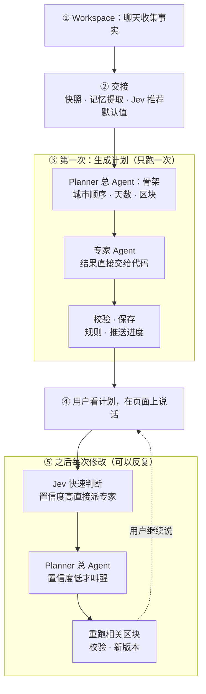

# Agent Planner 规划（进行中）

> 这是 Generate plan 背后 Planner Agent 的**规划工作区**，边讨论边增删改。每节标明状态：
> **已定**（讨论过、你确认了）、**草案**（我提的，还没确认）、**待讨论**（还没聊到）。
> 已经实现的部分以 [src/agents/README.md](../../src/agents/README.md) 为准；这里定下来、做出来以后，再写进那份文档。
> 讲过的 Agent 概念整理在 [agent-lessons.md](agent-lessons.md)。

## 进度

| 次 | 主题 | 顺带讲的概念 | 状态 |
| --- | --- | --- | --- |
| 1 | 业务：计划是什么，信息不全怎么办，记忆 | Agent 是什么、生成者 + 验证者、MCP、记忆、交接、工具就是函数 | 已定 |
| 2 | 页面：区块、空块引导、生成中、过期 | 分区块与依赖、真实进度（流式事件） | 进行中，大部分已定 |
| 3 | 运行：从点按钮到出结果、失败、重启；模块划分（总管 + 专家） | 工作流里放 Agent、可恢复与预算、多 Agent | 进行中 |
| 4 | 工具：需要哪些、返回什么、数据拿不拿得到 | 工具设计、追踪、评估 | 文档已查，待实测 |

全部讨论完、文档定稿以后才写代码。页面那次讨论后，你可能会生成一张效果图，我们对着图再调整。

## 1. 背景（已定）

**为什么做：** Meri 是面向 AI 工程岗位（Tesla、Microsoft）的作品集，Generate plan 直接按 Agent 架构做，不先做固定流程版。框架用 Mastra，Agent 放在 `src/agents/`；以后做 Agent 评估。不做 LangGraph 版本（2026-10-05 决定）。

**用户怎么旅行（你自己的习惯）：**

```text
出发前：怎么到那里（机票 / 高铁）
每天：  住在哪 → 明天去哪些景点 → 怎么排顺序、路上多久
        → 核实：几点开门、几点去最好、会不会下雨、要不要预约、电话多少、评价是不是真的
        → 一边玩一边用高德导航
```

所以计划的核心是**每一天一张卡**：住哪、去哪、顺序、路程、核实结果。

**你的八条思考，以及它们对设计的影响：**

| 思考 | 对 Meri 的影响 |
| --- | --- |
| 用户更在乎"行不行得通"，需要规则验证层 | 每天一个可行性检查，由代码按规则判断（第 2 节） |
| 修改能力比生成更重要，私人约束最后才说 | 计划页可以对话修改；对话中的约束由 Planner 记进记忆（第 3 节） |
| 旅行规划是对话，不是一次性生成 | 计划页旁边有对话入口 |
| 未来按约束而不是按目的地出发 | 远期方向（第 8 节），推荐卡已部分是这个思路 |
| 先给思路，不执着于一次就对 | 分层给计划，空块引导（第 2 节） |
| 用户画像可以被生成、修改、否定 | 记忆清单：自动记下，看得见，能删能改（第 3 节） |
| 高频需求是目的地内部景点之间的路线 | 路线工具的重点是景点 → 景点、酒店 → 景点 |
| 订票付款的越权风险 | Meri 不订不付；下单类工具不给 Agent |

## 2. 业务（已定）

### 2.1 信息不全时：先给能给的，缺什么锁什么

（2026-10-05 改：原来是"生成前先问天数"，改为解锁方式。）

- 只有目的地也能生成：给一个**示范的第一天**。
- 缺的信息不挡住生成。对应的区块显示为锁住的空块，空块里直接告诉用户补什么能解锁，并带行内输入框（"告诉我你玩几天，我把剩下的几天排出来"）。
- 哪个区块需要什么信息，由代码判断（见 4.2），不由模型判断。

### 2.2 v1 计划包含什么

每天：
- 住哪一带，以及附近的酒店（有价格就给价格，标明查询时间）
- 去哪些景点、什么顺序、开放时间、什么时候去最好
- 段与段之间的路程和时长（来自路线工具）
- 天气（几天内用预报，更远的只描述季节特点，不给数字）
- 要不要预约、电话
- 可行性检查：路上总时长、开放时间对不对得上、徒步能不能在天黑前走完、会不会下雨。由代码判断，不由模型判断

"怎么到那里"：机票、酒店用 OTA 的 MCP 给真实价格并标明查询时间；高铁能从 MCP 拿到什么就给什么，拿不到就给方向和链接。

拿不到的信息放进"不知道"列表，并告诉用户去哪里查，不猜。

### 2.3 修改

- 计划页可以对话修改，比如"第二天太赶了""换个酒店"。
- 用户说什么就按什么改，不给偏好排优先级、不算权重。
- 每次修改生成新版本。

### 2.4 边界

- **Meri 永远不订、不付**，只给信息、电话和链接。
- 接入的 OTA MCP 里有下单类工具，这些工具**不交给 Agent**。Agent 能用哪些工具由代码里的白名单决定。

## 3. 记忆（已定；存储为草案）

### 3.1 问题

Planner 的输入是 TripState 快照，不读聊天记录，为的是防止删掉的地点从历史里回来。但这样一来，用户在聊天里说的"我不吃辣""一天最多走 15 公里"就到不了 Planner。

### 3.2 形式：一条条记住的事，而不是一段摘要（已定）

```text
Meri 记得：
  · 不吃辣                    — 来自 10月3日「我不吃辣哈」          [×]
  · 一天最多走 15 公里         — 来自 10月3日「我一天最多走15公里」    [×]
  · 带父母，父亲膝盖不好        — 来自 10月4日「这次带爸妈…」           [×]
```

每一条记忆有：内容、用户原话、出自哪条消息、时间、状态（有效 / 被取代 / 用户删除）。

规则：
1. **防编造**：每条必须引用用户原话，代码检查这句原话真的出现在某条用户消息里，对不上就不保存。
2. **看得见、改得了**：清单显示在计划页，每条能删能改。
3. **矛盾**：新的话取代旧的话（"其实微辣可以"取代"不吃辣"），旧的一条标为已取代，不揉在一起。
4. **自动保存，不用确认**：偏好记错了代价小、看得见、一点就删。地点不同，地点仍然要确认。
5. **地点不进记忆**：地点只以 TripState 为准。

### 3.3 在哪里产生、谁来维护：交接（已定）

Workspace 是收集事实的阶段，计划页是规划阶段。点 Generate plan 时做一次**交接**：

```text
Workspace（固定流程，Vercel AI SDK）          计划页（Mastra Planner）
  聊天记录 + TripState
        │  点 Generate plan
        ▼
  交接包：① TripState 快照（事实）          → Planner 的输入
          ② 一次提取：聊天 → 记忆清单        → 显示在计划页，用户可删改
             （每条带原话，代码校验原话）
          ③ 今天日期、语言
                                              之后：计划页的对话由 Planner 处理，
                                              记忆由 Planner 通过工具维护
```

- **不在每一轮聊天里提取**：不改调好的中文聊天提示词，快照锁不动。
- **之后由 Planner 维护**：用户在计划页说"其实微辣可以"，Planner 调用记忆工具更新清单。

### 3.4 存储（草案）

- 记忆存在 **Meri 自己的表**里，Planner 通过自己的工具（例如 `remember`、`forget`）读写；写入前代码校验原话。
- 不用 Mastra 自带的 working memory：它由 Agent 直接改写，没法在中间插入校验；而且记忆是用户看得见、能改的产品数据，存在 Meri 自己的表里，Workspace 之外的页面和以后的评估都能直接读。

### 3.5 单向流程（已定）

过了 Workspace 就不回去：Workspace 收集事实，点 Generate plan 进入计划页，之后都在计划页完成。所以记忆只在交接时提取一次，之后由 Planner 维护，不需要增量提取。目的地在交接后固定，要换城市就新建旅程。

## 4. 页面（进行中 — 第 2 次）

### 4.1 已知前提

- 点 Generate plan 后进入一个新页面。
- 有对话入口，用来修改。
- 显示这次用了哪些记忆，每条能删能改。
- 单向流程，不回 Workspace（3.5）。缺的事实在计划页的空块里**点选**补上：天数点 3 / 5 / 7 / 自定义，交通方式点选，出发地用输入加建议。点选由代码处理，不调用模型、不花 token。
- 示范的第一天：用户在 Workspace 选的城市，一一对应；选了多个城市时用排第一的。它是 Planner 的一次**小范围运行**（区块任务，例如 `{ block: "day", city: "丽江", day: 1 }`，预算更小），不是单次模型调用，因为要调工具查景点、开放时间和路程。
- 以后要做大量动态效果，参考 [visual-media-direction.md](../product/visual-media-direction.md)。

### 4.2 区块和解锁（草案）

```text
┌ 怎么到那里 ───────────────────────────┐
│ 🔒 告诉我你从哪出发，我帮你查机票和高铁  │  ← 行内输入框，填完这块就解锁
└──────────────────────────────────────┘
┌ 第 1 天 · 丽江（示范） ─────────────────┐
│ 玉龙雪山 → 蓝月谷 → 丽江古城…           │  ← 只有目的地也能给
└──────────────────────────────────────┘
┌ 第 2 天、第 3 天… ─────────────────────┐
│ 🔒 告诉我你玩几天，我把剩下的几天排出来   │
└──────────────────────────────────────┘
┌ 天气、酒店价格 ───────────────────────┐
│ 🔒 告诉我哪天出发                       │
└──────────────────────────────────────┘
```

| 区块 | 需要什么才解锁 |
| --- | --- |
| 示范一天 | 目的地 |
| 其余几天 | 天数 |
| 机票 / 高铁 | 出发地，且交通方式不是自驾 |
| 自驾路线 | 出发地，且交通方式是自驾 |
| 天气、酒店价格 | 出发日期 |

用户补了一项信息，**只重算依赖它的区块**（依赖图上的增量重算），不用整个计划重来。

### 4.3 点选后能否修改（已定）

确认后收起成结果（例如"5 天 ✓"），旁边留一个小的"修改"。改了只重算依赖它的区块，例如改天数只重排每天，不重查机票。

### 4.4 打开计划页先看到什么（已定）

两者都要：
- **顶部一句话总览**：例如"云南 5 天：丽江 → 大理"，以及有几个区块还锁着。
- **地图显示当天的路线**：选中哪一天，地图就画那一天的景点和段与段的路线。

地图用**高德 JS 地图**（已定）：坐标和我们的数据都是高德的 GCJ-02 坐标，直接对得上；中国的地图数据最全；可交互。需要另申请一个 Web 端 JS key 和安全密钥。
没选的：高德静态地图图片（不能交互）；Leaflet + OpenStreetMap（中国数据少，坐标体系 WGS-84 不转换会偏几百米）。

### 4.5 生成中：游戏感的过渡和真实进度条（已定）

点 Generate plan 后有一个 hero 式的过渡，带游戏感和进度条；以后首页打开时也做 hero 效果，两者用同一套视觉语言。

原则：**进度条由真实的运行事件推动，不用假进度**。每完成一步（核实丽江、查路线、查开放时间、排好第一天），服务器推送一个事件，进度往前走一格。

形式：小熊沿着一条山路走，路上的每个营地就是一个真实步骤，到了就点亮。2D 像素风，和首页的像素山景、小熊统一；不做 3D（3D 仍放在 Generate plan 之后）。系统设置"减少动态效果"时，只显示简单的进度条和步骤文字。

素材缺口：现有小熊精灵图只有坐在小桌后的动作，**没有走路**。两种做法等效果图出来再定：一跳一跳前进（现有素材够用），或新做 6–8 帧侧面走路（更生动，需要参考图）。

### 4.6 待讨论

- 页面描述已写好：[page-mockup-brief.md](page-mockup-brief.md)（三张图的内容和英文生成提示）→ 你生成效果图 → 对着图调整。
- 区块过期的提示方式（事实改了，依赖它的区块要重算）。

## 5.0 模块划分：一个总 Agent + 专家（已定结构，细节草案）

结构（2026-10-06 定）：

```text
工作流（代码）── 管顺序、保存、失败、进度
   └ Planner（总 Agent，Kimi）── 只在需要判断时被叫醒
        ├ 每日行程专家（Agent）
        ├ 交通专家（Agent）
        └ 住宿专家（Agent）
   Jev：在 Planner 前面和专家里面做快速判断
   工具 / 代码：天气、地点、路线、搜索、记忆、可行性检查
```

Planner 在两个时刻被叫醒：
- **生成时**：看全部信息，输出结构化的骨架（城市顺序、每城几天、要生成哪些区块），代码照着骨架派给专家。
- **修改时**：Jev 拿不准的请求交给它，它拆任务并排先后、反问不清楚的话、调用记忆工具、判断只是提问就直接回答、最后告诉用户改了什么。

顺序、保存、进度这些不需要思考的事由代码负责，不经过 Planner：更快、更便宜、更稳定，也才能设检查点。

**专家的结果不经过 Planner 转述**：专家返回结构化 JSON，直接交给代码校验和保存。Planner 只派活，最后用一句话告诉用户改了什么。（社区总结的总管模式常见问题之一是转述失真："无法核实 X"被转述成"X 没确认"，意思在每次交接中漂移。）

**业界对照**（2026-10-06 查证）：外层流程 + Agent 判断对应 Anthropic《Building effective agents》的建议；Planner + 专家对应 orchestrator-workers 模式（Anthropic 的 Research 系统就是主 Agent 加并行子 Agent）；Jev 关口对应 routing 模式（小模型分类、按置信度回退大模型，RouteLLM 报告成本降 85% 以上、保持 95% 质量）。Jev 本身才发布几周，面试时讲的是这个模式，Jev 是具体实现，要有自己的实测数据。

| 模块 | 是不是 Agent | 做什么 | 工具 |
| --- | --- | --- | --- |
| Planner（总 Agent） | Agent（Kimi），前面有 Jev 快速关口 | 生成时输出骨架；修改时理解意图、拆任务、派给专家、更新记忆 | 各专家（作为工具）、天气、城市间路线、`remember`、`forget` |
| 每日行程（Day planner） | Agent | 从候选池挑当天的景点、排顺序（按半天天气安排室内/户外）、开放时间、路程、饭点 | 地点核实、地点详情、周边搜索、路线、天气、网页搜索 |
| 交通（Transport） | Agent | 怎么到目的地：机票、高铁、自驾 | 机票 MCP、高铁（看 MCP 能给什么）、驾车路线 |
| 住宿（Stay） | Agent | 每晚住哪一带、附近酒店和价格 | 酒店 MCP、周边搜索 |
| 天气 | 不是 Agent，是工具 | 城市 + 日期查预报；超出预报范围只给季节说明。用天气做决定（先去哪个省、下雨排室内）是 Planner 和每日行程的事 | 天气服务（高德只有白天/夜间；分上午下午需要逐小时预报，例如和风天气，待实测） |
| 可行性检查 | 不是 Agent | 按规则判断一天行不行得通 | 纯代码 |
| 记忆提取（交接时） | 不是 Agent | 从聊天提取记忆清单 | 一次模型调用 + 代码校验原话 |

整体流程（草案，按时间顺序：①–③ 只发生一次，④⑤ 可以反复）：



讨论顺序：每日行程 → Planner 总 Agent（生成时的骨架） → 可行性检查 → 交通 → 住宿 → 天气工具 → 记忆 → Planner 在修改时的工作。

**Mastra workflow 和手写流程的区别**：概念一样（按顺序执行步骤）；Mastra 另外自带可恢复（检查点）、暂停等用户（suspend / resume）、每步追踪、并行/分支/重试、进度事件。只有 Planner 用 Mastra workflow；现有的推荐、聊天流程是几秒的一问一答，不需要这些能力，**暂不改造**（以后为统一追踪可选）。

**Jev（TypeSafe AI，2026-09-15 发布）用作快速决策（草案，待实测）**：Jev 不写文字，只返回三种类型化的决定——Choice（选中的选项、每个选项的概率、置信度）、Score（得分等级、每个等级的概率、置信度）、是/否（为"是"的概率）；字段名以 SDK 为准；号称 70–500 毫秒，输入 $0.042/百万 token，输出免费；有 TypeScript SDK；不能调用工具。用在（流程图只画到 Agent 一层，Jev 多数在 Agent 里面）：

| 在哪一步 | Jev 做什么 | 类型 |
| --- | --- | --- |
| ② 交接 | 每句用户的话是不是偏好或约束，是才交给提取 | 是/否 |
| ② 交接 | 给锁住的区块算推荐默认值：建议天数（看城市数量和记忆，如带父母放慢节奏）、建议交通方式；预先选中"推荐"按钮，用户点一下才算数；置信度低就不标推荐 | Choice |
| ② 交接、⑤ 修改 | 新的一条是否取代已有的某一条（"微辣可以"取代"不吃辣"） | Choice |
| ③ 每日行程 Agent 里 | 候选池打分：每个景点适不适合这位用户和这天的天气 | Score |
| ③ 每日行程 Agent 里 | 多个候选时选一个（"苍山"），置信度低就把替换标签显示得更醒目 | Choice |
| ③ 校验 | 软性检查：规则管不到的，比如"父亲膝盖不好"对上陡峭山路，这天会不会太累；置信度低就在卡片上提醒 | Score |
| ⑤ 修改 | 是不是在改计划、派给哪个专家 | 是/否 + Choice |

接入顺序（中文实测通过后）：候选池打分 → 修改路由 → 推荐默认值 → 软性检查 → 其余三处。每多一处都要实测和评估，不硬塞。

**例子：交接时 Jev 算推荐默认值**（概率数字为示意，实际以中文实测为准）

用户在 Workspace 定了"丽江、大理"，没说天数，也没说怎么去。交接时代码把当前状态整理成文字交给 Jev：

```text
目的地：云南省 · 丽江市、大理白族自治州
出发地：上海
天数：没填
交通方式：没填
记忆：带父母 · 父亲膝盖不好 · 不想太赶
```

代码问 Jev 两个 Choice 问题，选项由代码事先定好：

```text
问题 1：适合玩几天？ 选项：3、4、5、6、7、8 天
  选中：6 天   置信度：高
  概率：3天 2% · 4天 8% · 5天 30% · 6天 41% · 7天 15% · 8天 4%
  （两个城市，带父母、膝盖不好、不想太赶 → 多留一天，节奏放慢）

问题 2：怎么去比较合适？ 选项：自驾 / 高铁 / 飞机
  选中：飞机   置信度：高
  （上海到丽江远，丽江有机场）
```

页面上显示：

```text
┌ 第 2–6 天 ──────────────────────────────────────────┐
│ 🔒 告诉我你玩几天                                       │
│   [ 4 天 ]  [ 5 天 ]  [ 6 天 · 推荐 ✓ ]  [ 7 天 ]  [ 自定义 ] │
└────────────────────────────────────────────────────┘
┌ 怎么到那里 ─────────────────────────────────────────┐
│ 🔒 怎么去？                                            │
│   [ 自驾 ]  [ 高铁 ]  [ 飞机 · 推荐 ✓ ]                  │
└────────────────────────────────────────────────────┘
```

- "推荐"按钮预先选中，但区块仍然锁着；用户点"确认"才解锁，也可以改选别的。天数和交通方式是事实，必须由用户决定，Jev 只是把"想一想再填"变成"点一下"。
- **置信度低时不标推荐**。例如只选了"海南"、没有记忆：Jev 选 5 天，但概率是 3天 22% · 4天 24% · 5天 26% · 6天 18% · 7天 10%，几个选项差不多。这时几个按钮平等显示，硬标一个推荐反而误导用户。
- 为什么用 Jev 不用 Kimi：这是从固定选项里选一个的问题，Jev 几十毫秒、几乎不花钱，而且置信度是校准过的，能直接决定"标不标推荐"；Kimi 更慢更贵，它说"很确定"不一定真的确定。

不用 Jev 的地方：
- **Workspace**：每轮都要 Kimi 写回复，理解意图和写回复是同一次调用，加 Jev 省不了调用；中文提示词已锁定。Jev 从交接开始用。
- **生成时派给哪些专家**：由事实推出（有出发地且不是自驾 → 交通专家要跑），代码 100% 准确、零成本。原则：事实能推出的用代码，需要判断的才用 Jev 或 Agent。

**只有一个总 Agent（Planner）**，在生成和修改两个时刻被叫醒（见 5.0）。

原则是按置信度分流：高置信度直接执行，低置信度交给 Kimi 或用户。代码里把"做一个类型化决定"抽成接口，Jev 和 Kimi 各一个实现，Jev 不可用时回退 Kimi。

风险，在工具模块实测：中文输入支持没有写明；服务在美国西海岸（用户消息会发到美国，要在文档写明数据流向）；刚发布，接口和注册方式可能变化。每个模块讨论输入、输出、工具、规则、失败处理、预算、页面显示。

### 模块 2：Planner 生成时出骨架（讨论中）

输入：TripState 快照、记忆、今天日期（和交接时 Jev 算的推荐默认值）。输出：骨架——城市顺序、每城几天、要生成哪些区块、每个决定的理由。

待你回答（括号里是我的倾向）：
1. 示范第一天：坚持用户选的第一个城市 / 用 Planner 排序后的第一天（坚持用户选的）。
2. 只有省没有市：Planner 挑一个城市并说明理由，给可点的替换标签 / 锁住请用户先选（前者）。
3. 城市顺序：Planner 综合地理、天气、用户顺序判断并写理由，不算权重；代码只检查没漏城市、天数对得上（同意吗）。
4. 城市之间转场：作为某天的一段路程 / 单独的转场日（作为一段路程）。
5. 顶部总览：代码按模板拼 / Planner 写一句（代码拼，不花 token、中英稳定）。
6. 改天数后：重跑 Planner 出新骨架，只重跑天数有变化的那几天（同意吗）。

### 模块 1：每日行程（已定）

1. **候选池**：先把这个城市的知名景点全部搜出来（用户在 Workspace 选的、Agent 提出并经高德核实的、高德周边景点搜索的），存成缓存。每天的排程从池子里挑；用户可以点按钮隐藏或加入景点，Agent 从缓存里重排当天，不重复调工具。每天几个景点由 Agent 按记忆决定（例如带父母、膝盖不好就少排），默认 3–4 个。
2. **时间**：给大约时间，并标明"时间仅供参考，请自己把握"；开放时间写查到的精确时刻。
3. **景点来源**：用户选的景点必须排进去；其余来自 Agent 提候选（每个都用高德核实，核实不了就丢）和高德周边搜索。
4. **吃饭**：每天中午推荐一家附近的饭店（高德，带电话），照顾记忆里的忌口；细节以后再议。
5. **多城市分天**：由 Planner 总 Agent 在生成骨架时决定，代码校验每个城市至少 1 天、总天数对得上。
6. **景点名有多个候选**：选最可能的一个，卡片上写"我选了 X"，旁边列出其他候选作为可点的小标签，点一下就换。不打断生成，但让用户参与。

## 5. 运行（进行中 — 第 3 次，草案）

### 5.1 结构：工作流里放 Agent

外层是固定的工作流，管顺序、保存和失败处理；Agent 只是其中一步，负责研究。

```text
外层工作流（代码写死）
  ① 准备：TripState 快照、一次记忆提取、算出哪些区块能解锁
  ② 对每个能解锁的区块：
       ├ Agent 研究（自己调工具，有预算）
       ├ 整理成 JSON（单独一次调用）
       ├ 代码校验，不过就把问题告诉 Agent 改，最多 2 次
       └ 保存这个区块，推送事件给页面
  ③ 收尾：写总览、更新状态
```

### 5.2 从点按钮到出结果

1. 在 Workspace 点 Generate plan：服务器做交接，创建计划记录，在服务器后台启动工作流，浏览器跳到计划页。
2. 计划页连上进度流，小熊过渡页按真实事件前进。
3. 示范第一天优先跑；其他能解锁的区块随后跑（高德每秒约 3 次，并行实际上也是排队）。
4. 用户关掉页面，运行不中断；状态在数据库里，回来能看到进度或结果。
5. 用户点选补信息：代码直接更新 TripState，不调模型；只对依赖它的区块启动一次小运行。
6. 计划页对话修改：Planner 处理这条消息，可能调 `remember` 记下偏好，然后重跑受影响的区块。

### 5.3 失败处理

| 情况 | 处理 |
| --- | --- |
| 某个工具或服务失败 | 该区块显示"暂时查不到"加重试按钮，其他区块不受影响 |
| 模型调用失败 | 自动重试 1 次，还失败按上一条处理 |
| 碰到预算上限 | 保存已有结果，标"未完成" |
| 代码校验 2 次都没通过 | 不保存这个区块，显示失败原因和重试 |
| 服务器重启 | 从最后一个检查点接着跑，已完成的区块不重做 |

### 5.4 预算初始值

每个区块最多 10 步、15 次工具调用、60 秒；整次运行最多 3 分钟。先这样设，跑起来按实测调整。

### 5.5 待定（会并进各模块的讨论里，问得更具体）

1. 部分成功（一块失败、其他照常）是否可以。
2. 暂停问用户放在哪里（见模块 1 第 6 问）。
3. 对话修改是直接改，还是先说明再改（到"总管"模块讨论）。
4. 示范第一天先跑、其他随后，是否可以。

### 5.6 1.0300 试验已经确定的约束（已定）
- 工具加结构化输出必须分两步：先让 Agent 跑完工具循环，再单独一次调用整理成 JSON。放在同一次调用里，Kimi 会跳过工具，还会用大量空行填充 JSON。
- 哪些内容核实过，由代码根据工具结果判断，不信模型的说法。
- 必须告诉 Agent 今天的日期。
- 每次运行有预算上限：步数、工具调用次数、时间、token。
- 用可恢复工作流：服务器重启后能接着跑，以后能暂停问用户。

## 6. 工具（进行中 — 文档已查，待实测）

### 6.1 官方文档核对结果（2026-10-06）

| 想知道的 | 文档怎么说 | 对设计的影响 | 还要实测什么 |
| --- | --- | --- | --- |
| 开放时间、电话、评分 | 高德 v5 地点搜索和详情的 `show_fields=business` 返回 `opentime_today`（今日营业时间）、`opentime_week`（营业时间描述）、`tel`、`rating`（餐饮、酒店、景点、影院才有）、`cost`（人均消费） | 每日行程能写开放时间和电话；我们已有的高德调用加一个字段即可 | 景点上这些字段实际有没有值 |
| 天气 | 高德天气只有 **3 天**预报，只分白天/夜间，**没有上午下午** | 半天粒度（下雨排室内）用不了高德 | — |
| 逐小时天气 | 和风天气逐小时预报 **1–240 小时（10 天）**，1 公里分辨率，含降水概率；**每月前 5 万次免费**；同一套餐含天文（日出日落） | 天气工具改用和风天气：10 天内可按小时排室内/户外；日出日落也有了（可行性检查的"天黑前走完"） | 申请 key，确认免费额度内的范围 |
| 景点之间的路线 | 高德路线（驾车、步行、公交） | 已知可用 | — |
| 机票 | RollingGo 机票 MCP：`searchAirports`、`searchFlights`（日期、航线、人数、舱位），500+ 航司，免费、无调用上限，个人可申请 | 交通专家的机票来源 | `searchAirports` 按英文城市名查，中文城市要实测 |
| 酒店 | RollingGo 酒店 MCP（API key 版）：`searchHotels`、`getHotelDetail`、`getHotelSearchTags`，streamable-http，免费、无上限。下单工具只在 OAuth 版里 | 住宿专家的来源；用 API key 版，**本身就没有下单工具**，符合"不订不付" | 价格是否实时、返回字段 |
| 高铁 | 途牛火车票 MCP：车次搜索、座位余票和价格，需在途牛开放平台申请 `TUNIU_API_KEY`（官方文档页本次连不上，细节待查）；飞猪 FlyAI 有 `search-train`，可不用 key，但只有 CLI 和 Agent skill，文档没写服务器可用的接口和使用条款 | 高铁优先用途牛；飞猪作为备选，先确认能否在服务器调用、条款是否允许 | 申请途牛 key；看真实返回 |
| Jev | JS SDK `@typesafe-ai/sdk`，在 console.typesafe.ai 取 key；文档**没写中文支持**；明确写了弱项：不会可靠地数数、算数、比较日期先后或两个数值是否接近 | 数字和日期都由代码算好再交给 Jev（例如可行性软检查只给它"路上 4.5 小时、坡度大"这种已算好的描述）；推荐天数的选项是固定标签，可以 | 注册是否开放；中文判断准确率 |
| 网页搜索 | AnySearch：可匿名使用（限流更低），注册后更高；`search`、`batch_search`、`extract`（抓整页）；文档**没写中文内容覆盖**（有中文 README） | 先和 Bocha 对比再决定首选 | 同一批中文旅游问题对比结果 |
| 小红书 | 暂不接入 | — | — |

### 6.2 工具选型和要准备的 key（2026-10-06）

| 用途 | 选型 | key | 去哪申请 | 环境变量名（建议） |
| --- | --- | --- | --- | --- |
| 地点核实、开放时间、电话、周边搜索、路线 | 高德（已在用） | 已有 | — | `AMAP_API_KEY` |
| 计划页地图 | 高德 JS 地图 | 另申请 Web 端（JS API）key + 安全密钥 | lbs.amap.com 控制台 | `NEXT_PUBLIC_AMAP_JS_KEY`、`AMAP_JS_SECURITY_CODE` |
| 天气（逐小时、日出日落） | 和风天气 QWeather | 要 | dev.qweather.com 控制台 | `QWEATHER_API_KEY`（加分配的 API Host） |
| 机票 + 酒店 | RollingGo（道旅），一个平台两个 MCP | 要 | rollinggo.store（个人可申请，自动审核） | `ROLLINGGO_API_KEY` |
| 高铁 | 途牛开放平台 | 要 | open.tuniu.com | `TUNIU_API_KEY` |
| 快速判断 | Jev（TypeSafe） | 要 | console.typesafe.ai/keys | `TYPESAFE_API_KEY` |
| 网页搜索（首选候选） | AnySearch | 可选 | anysearch.com | `ANYSEARCH_API_KEY` |
| 网页搜索（备选） | Bocha（已在用） | 已有 | — | `BOCHA_API_KEY` |
| 大模型 | Kimi（已在用） | 已有 | — | `MOONSHOT_API_KEY` |

不选：Amadeus（个人版已关闭）；飞猪 FlyAI（只有命令行工具，服务器调用和使用条款不清楚，观望）；小红书（调研中）。

**12306 社区 MCP**（如 drfccv/mcp-server-12306，不用 key，数据来自 12306）：不作为正式依赖。它们调用 12306 网页的公开查询，不是官方接口，网页一改就可能失效；12306 有反爬限制，部署到日本 VPS 后更容易被限制；有的版本靠更换 UA 绕过封禁，这类做法我们不用。可以在本地试着看数据。

key 只放在本地 `.env.local`，不提交、不发到对话里；`.env.example` 只加变量名。

### 6.3 下一步实测（只写验证脚本，不写产品代码）

和 1.0300 的试验一样，每个服务一个脚本，用真实问题跑几次：
- 高德：丽江、大理几个景点的营业时间和电话；
- 和风天气：丽江未来 48 小时的逐小时预报；
- RollingGo：上海到丽江的航班、丽江古城附近的酒店；
- 途牛：昆明到大理的车次和余票；
- Jev：用中文的修改语句测路由、用记忆测推荐天数；
- AnySearch 对比 Bocha：雨崩封路、玉龙雪山预约等 5 个问题。

工具来源会有两种：自己写的（包装 `src/platform` 的接口），和通过 MCP 接入的（RollingGo、途牛）。MCP 接入的工具也要过白名单，返回结果要缩减和校验。

## 7. 数据（草案，等业务定了再改）

第 1 次讨论前我提过一个草案，业务没定，暂不采用：
- `domain/plan`：Plan（每天、地点、路程、天气、不知道的、来源），`validatePlan`，`isPlanStale`。
- `trip_plans` 表：每生成一次一行，存生成时的 TripState 快照、计划 JSON、状态、用量和追踪 ID。
- Mastra 自己的表放进单独的 Postgres schema `mastra`。

讨论完页面和运行后，按最终业务重新设计，还要加上记忆的存储。

## 8. 远期方向（不在 v1）

- **按约束出发**：用户只说"两大一小、十月、暖和、预算 1000 美元"，没有目的地，Meri 从约束推出目的地。
- **小红书**真实评价，等你调研完再定。
- **Agent 评估**：成本、延迟、质量报告。
- 出发前几天按最新预报自动重排（属于后台监控）。
- 分享链接、PDF 导出、3D 营地（见 [visual-media-direction.md](../product/visual-media-direction.md)）。

## 9. 决策记录

| 日期 | 决定 |
| --- | --- |
| 2026-10-05 | 先完整规划（业务、页面、运行、工具），再写代码，不边写边想 |
| 2026-10-05 | 信息不全：先给能给的（示范一天），缺什么锁什么，空块里补信息解锁（取代同日"先问天数"） |
| 2026-10-05 | v1 计划内容见 2.2；机票酒店用 OTA MCP 给真实价格；高铁能拿到什么给什么 |
| 2026-10-05 | 计划页可对话修改，用户说什么就按什么改，不算权重 |
| 2026-10-05 | 记忆做成带原话的清单，代码校验原话，自动保存、可删改、可取代；不含地点 |
| 2026-10-05 | 记忆在点 Generate plan 时一次性交接给 Planner，之后由 Planner 维护；不在每轮聊天里提取（改自同日"每轮提取"的方案） |
| 2026-10-05 | 小红书暂不接入 |
| 2026-10-05 | Meri 永远不订、不付；下单类工具不给 Agent |
| 2026-10-05 | 记忆工具（remember / forget）自己写，存在 Meri 的 Postgres，不需要外部依赖 |
| 2026-10-05 | 单向流程：过了 Workspace 不回去；缺的事实在计划页点选补上，点选不调用模型；目的地交接后固定 |
| 2026-10-05 | 示范第一天 = 用户选的城市（多个时取第一个），由 Planner 的一次小范围区块任务生成 |
| 2026-10-05 | 不做 LangGraph 版本 |
| 2026-10-05 | 点选确认后收起，留"修改"，只重算依赖的区块 |
| 2026-10-05 | 计划页顶部一句话总览，加当天路线地图 |
| 2026-10-05 | 生成时 hero 式游戏感过渡，进度条由真实运行事件推动 |
| 2026-10-05 | 地图用高德 JS 地图 |
| 2026-10-05 | 生成过渡：小熊沿山路走，营地 = 真实步骤；2D 像素风，不做 3D |
| 2026-10-06 | 多 Agent：总管 + 专家；生成时代码路由，对话修改时总管路由 |
| 2026-10-06 | 天气是工具不是 Agent；用天气做决定（城市顺序、室内/户外）由行程骨架和每日行程两个 Agent 负责 |
| 2026-10-06 | 每日行程：候选池缓存、大约时间、用户选的景点优先、中午一家饭店、多候选时"我选了 X"加可点替换 |
| 2026-10-06 | 现有推荐、聊天流程暂不改造为 Mastra workflow |
| 2026-10-06 | 快速决策用 Jev（路由、候选打分、多候选选择），按置信度分流，Kimi 后备；草案，待中文实测 |
| 2026-10-06 | Workspace 不用 Jev；Jev 从交接开始，交接时给锁住的区块算推荐默认值（天数、交通方式），用户点击确认 |
| 2026-10-06 | 行程骨架 Agent 就是生成时的总管；生成时派活由代码按骨架和事实决定 |
| 2026-10-06 | 结构定为：工作流（代码）→ Planner 总 Agent → 每日行程 / 交通 / 住宿三个专家；Jev 在 Planner 前面和专家里面做快速判断；行程骨架和修改总管合并进 Planner |
| 2026-10-06 | 天气工具改用和风天气（逐小时 10 天、每月 5 万次免费、含日出日落）；高德天气只有 3 天、只分昼夜 |
| 2026-10-06 | 酒店用 RollingGo 的 API key 版（本身没有下单工具）；机票 RollingGo；高铁优先途牛 |
| 2026-10-06 | 交给 Jev 的数字和日期都由代码先算好（Jev 文档写明不擅长数数、算数、比较日期） |
| 2026-10-06 | 工具选型定稿（6.2）；高铁用途牛，12306 社区 MCP 不作为正式依赖 |
